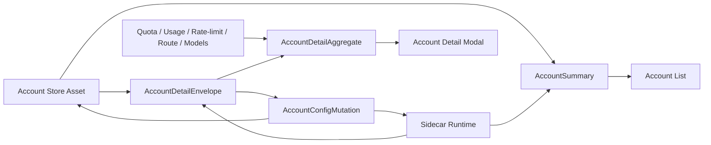
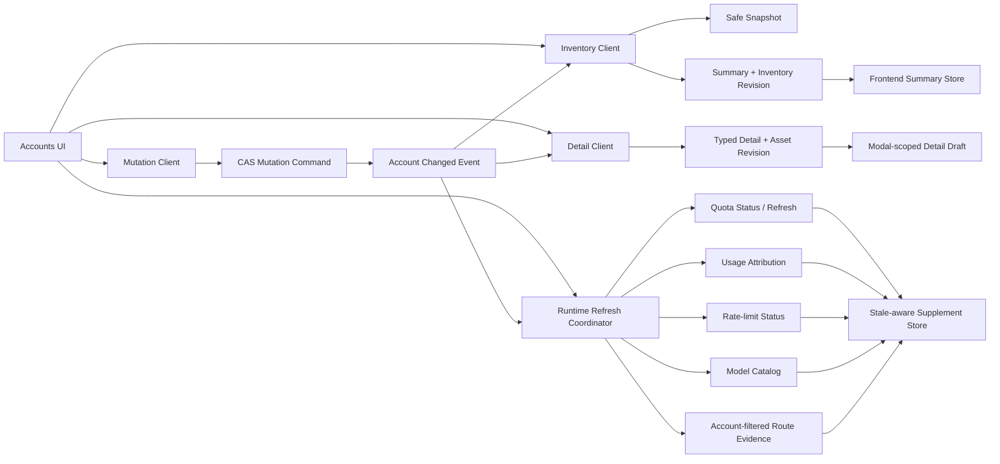

# 账号与账号详情完整实施方案

## 1. 方案状态

- 决策：Adopt，采用契约分层。
- 状态：decision-complete。
- 实施入口：本文。
- 调查依据：`account-detail-optimization-report.md`。
- 目标发布方式：sidecar 与 GetTokens App 同版本交付。

本文是可直接进入 BDD/TDD 和施工的完整方案。实施过程中不得重新选择“继续扩张 `AccountRecord`”或“由前端成为账号一致性 owner”。

## 2. 最终目标

账号系统最终形成五个明确契约：



1. `AccountSummary`：列表和首屏缓存使用，无敏感字段。
2. `AccountDetailEnvelope`：用户打开详情时按需读取，包含当前可编辑配置和资产 revision。
3. `AccountConfigMutation`：单次原子保存账号标题与 typed credential/config。
4. `AccountMutationResult`：区分资产保存、runtime apply 和后续刷新。
5. `SupplementEnvelope<T>`：统一详情补充数据的来源、新鲜度和失败语义。

## 3. 最脆弱假设

本方案假设 GetTokens App 与内置 sidecar 总是作为一个版本构建和发布。

如果该假设不成立：

- 新 App 不得回退调用旧 sidecar 的 credential-bearing list。
- Wails 必须 fail closed，保留上次脱敏 summary cache，并显示“sidecar 版本不支持账号详情契约”。
- 不通过前端兼容 mapper 伪造 detail。
- 不为了兼容旧 sidecar 重新把 secret 放回列表。

当前 GetTokens 的打包模型满足该假设，因此不引入长期 API version negotiation。

## 4. 约束

### 4.1 所有权

- SQLite：sidecar 独占。
- runtime apply、route guard、model registry、quota/rate-limit：sidecar 独占。
- Wails：IPC adapter 和本地工作台命令编排。
- frontend：view state、draft、模块展示和用户操作。

### 4.2 敏感信息

- summary、snapshot、localStorage、debug events、route decisions、usage attribution 不得包含 credential secret。
- detail 中的 API key 仅在 modal 打开期间存在于 WebView 内存。
- 关闭 modal、切换账号或删除账号时立即清空 detail 和 draft。
- 不建立跨 modal 的 credential detail cache。
- auth-file `auth_json` 不进入通用 detail；查看、导出、清洗继续走显式 auth-content 动作。

### 4.3 身份

- 业务身份固定为 `account_key`。
- `revision` 是账号可编辑资产配置版本，不是 OAuth token refresh 次数。
- background OAuth token writeback 不应仅因 token 变化让普通配置编辑产生冲突。
- `provider` 是 sidecar 资产事实；frontend 不再根据 base URL 改写它。
- vendor preset 只生成独立的 `vendorPresetID` / display metadata。

## 5. 最终 API

### 5.1 迁移期 API

为了不破坏仍依赖 full record 的 Wails 内部消费者，先新增：

```text
GET  /v0/management/accounts/summary
GET  /v0/management/accounts/snapshot
GET  /v0/management/accounts/:account_key/detail
PATCH /v0/management/accounts/:account_key/config
PATCH /v0/management/accounts/:account_key/priority
PATCH /v0/management/accounts/:account_key/status
```

迁移期保留：

```text
GET   /v0/management/accounts
GET   /v0/management/accounts/:account_key
PATCH /v0/management/accounts/:account_key
```

旧接口只能供 sidecar/Wails 内部迁移使用，不再绑定到新 frontend API。

### 5.2 最终收口

所有消费者迁移后：

- `/accounts/summary` 成为唯一列表契约。
- `/accounts/snapshot` 与 summary 使用同一个 mapper 和 sanitizer。
- `/accounts/:account_key/detail` 成为唯一 credential-bearing read。
- `/accounts/:account_key/config` 成为唯一完整配置 mutation。
- 旧 `/accounts` full list 删除，或改成 summary alias。
- 旧 `/accounts/:account_key` full record 删除。
- 旧完整对象 `PATCH /accounts/:account_key` 删除。

删除旧接口前必须通过静态搜索证明父仓无调用者。

## 6. Account Summary 契约

### 6.1 Response envelope

```json
{
  "schema_version": 1,
  "generated_at_unix_ms": 1780000000000,
  "degraded": false,
  "warnings": [],
  "accounts": []
}
```

字段语义：

| 字段 | 语义 |
| --- | --- |
| `schema_version` | summary wire schema 版本 |
| `generated_at_unix_ms` | sidecar 生成响应时间 |
| `degraded` | 是否使用 card-only 或其他降级读取 |
| `warnings` | 脱敏、可展示的非致命问题 |
| `accounts` | `AccountSummary[]` |

`warning` 从单字符串收敛为 `warnings[]`。迁移期 client 同时兼容 sidecar 旧单字符串，但 frontend 只消费数组。

### 6.2 AccountSummary

```json
{
  "account_key": "acct_xxx",
  "kind": "codex-api-key",
  "title": "Work Codex",
  "provider": "codex",
  "credential_source": "sidecar-management-api",
  "priority": 10,
  "disabled": false,
  "revision": 4,
  "updated_at_unix_ms": 1780000000000,
  "plan_type": "key",
  "credential_summary": {
    "source_file_name": "",
    "key_fingerprint": "sha256:...",
    "key_suffix": "1234",
    "base_url": "https://api.openai.com/v1",
    "prefix": "",
    "key_count": 1,
    "configured_model_count": 9,
    "has_headers": false,
    "quota_enabled": true,
    "billing_enabled": false
  },
  "runtime": {
    "apply_status": "applied",
    "routeability_status": "registered_routeable",
    "routeability_reason": "",
    "failure_class": "",
    "routeable": true,
    "registered_model_count": 9,
    "repair_outcome": "",
    "repair_action": "",
    "repair_trigger_status": "",
    "repair_trigger_class": "",
    "repair_trigger_reason": "",
    "last_repair_at_unix_ms": 0
  }
}
```

### 6.3 Summary 允许字段

- 稳定身份、kind、title、provider。
- disabled、priority、revision、updated time。
- plan type。
- 非敏感 credential 摘要。
- runtime evidence。
- UI 筛选、排序、分组所需的能力摘要。

### 6.4 Summary 禁止字段

- API key、API key entries。
- auth JSON、access token、refresh token。
- headers 值。
- cookie。
- quota/billing curl 内容。
- curl variables 值。
- model fetch API key。
- raw credential metadata JSON。
- 未脱敏 runtime error body。

### 6.5 Summary 降级

credential 行读取失败时：

- 返回 card-only summary。
- `degraded=true`。
- `warnings` 包含结构化错误摘要。
- `credential_summary` 只保留 card 表可安全得出的字段。
- 不将缺失 credential 解释为“账号没有配置”。
- frontend 列表可展示账号，但详情按钮进入后必须重新读取 detail。

## 7. Account Detail 契约

### 7.1 Response envelope

```json
{
  "schema_version": 1,
  "generated_at_unix_ms": 1780000000000,
  "degraded": false,
  "warnings": [],
  "asset": {},
  "credential": {},
  "runtime": {}
}
```

HTTP header：

```text
Cache-Control: no-store
Pragma: no-cache
```

### 7.2 Asset

```json
{
  "account_key": "acct_xxx",
  "kind": "codex-api-key",
  "title": "Work Codex",
  "provider": "codex",
  "credential_source": "sidecar-management-api",
  "priority": 10,
  "disabled": false,
  "revision": 4,
  "created_at_unix_ms": 1770000000000,
  "updated_at_unix_ms": 1780000000000
}
```

### 7.3 Typed credential

#### Auth file

通用 detail 只返回元数据：

```json
{
  "kind": "auth-file",
  "source_file_name": "codex-plus.json",
  "auth_type": "codex",
  "email": "masked@example.com",
  "plan_type": "plus",
  "modified_unix_ms": 1780000000000,
  "size_bytes": 2048
}
```

不返回 `auth_json`。原始内容继续由显式 auth-content API 获取。

#### Codex API key

```json
{
  "kind": "codex-api-key",
  "api_key": "secret",
  "base_url": "https://api.openai.com/v1",
  "prefix": "",
  "proxy_url": "",
  "websockets": true,
  "format_base_urls": {},
  "headers": {},
  "models": [],
  "excluded_models": [],
  "quota": {
    "enabled": true,
    "curl": "..."
  },
  "billing": {
    "enabled": false,
    "curl": ""
  },
  "platform_cookie": "",
  "curl_variables": {}
}
```

#### OpenAI-compatible

```json
{
  "kind": "openai-compatible",
  "provider_name": "deepseek",
  "runtime_provider_key": "",
  "base_url": "https://api.deepseek.com",
  "prefix": "",
  "api_key_entries": [
    {
      "api_key": "secret",
      "proxy_url": ""
    }
  ],
  "format_base_urls": {},
  "headers": {},
  "models": [],
  "quota": {
    "enabled": false,
    "curl": ""
  },
  "billing": {
    "enabled": false,
    "curl": ""
  },
  "platform_cookie": "",
  "curl_variables": {},
  "model_fetch_api_key": "",
  "model_fetch_base_url": ""
}
```

### 7.4 Detail hard failure

credential 无法完整读取时：

- 返回 HTTP 503。
- code：`account_detail_incomplete`。
- 不返回残缺 credential。
- 不允许 frontend 用 summary 构造编辑 draft。

runtime evidence 暂时不可读但 asset/credential 完整时：

- detail 可以返回 200。
- `degraded=true`。
- `warnings` 说明 runtime evidence 缺失。
- 编辑仍允许，保存结果重新给出 runtime apply evidence。

## 8. Runtime Evidence

列表和详情共用同一个 sidecar mapper：

```json
{
  "apply_status": "applied",
  "apply_error": "",
  "routeability_status": "degraded",
  "routeability_reason": "refresh_token_reused",
  "failure_class": "auth-error",
  "routeable": false,
  "registered_model_count": 9,
  "repair_outcome": "",
  "repair_action": "",
  "repair_trigger_status": "",
  "repair_trigger_class": "",
  "repair_trigger_reason": "",
  "last_repair_at_unix_ms": 0
}
```

规则：

- SQLite apply state 与 active route guard overlay 分离。
- GET 只做 evidence projection，不持久化 transient block。
- `apply_status=applied` 不自动设置最终 `routeable=true`。
- disabled 优先于 route guard 展示。
- frontend 不重新推断 runtime 状态机，只做 presentation tone。

## 9. Account Config Mutation

### 9.1 Endpoint

```text
PATCH /v0/management/accounts/:account_key/config
```

### 9.2 Request

```json
{
  "expected_revision": 4,
  "title": "Work Codex",
  "credential": {
    "kind": "codex-api-key"
  }
}
```

约束：

- `account_key` 只来自 path。
- `kind` 必须与当前资产 kind 一致。
- `provider`、`credential_source` 由 sidecar normalization 决定，不接受 frontend 随意覆盖。
- title 和 credential/config 在同一个事务保存。
- disabled 不进入 config mutation。
- priority 使用独立 endpoint，但同样接受 `expected_revision`。

### 9.3 CAS

事务内执行：

1. 校验账号存在且未删除。
2. 校验 kind。
3. 校验 `current_revision == expected_revision`。
4. 使用带 revision 条件的 card update 获取写锁。
5. 替换 typed credential rows。
6. revision 只增加一次。
7. runtime apply state 标记为该新 revision 的 pending。
8. commit。
9. commit 后执行有界 runtime apply。

不得采用“先 GET、在 Wails 拼完整对象、再 PATCH”的 read-modify-write。

### 9.4 Mutation result

```json
{
  "account_key": "acct_xxx",
  "asset_saved": true,
  "previous_revision": 4,
  "new_revision": 5,
  "updated_at_unix_ms": 1780000001000,
  "runtime_apply_status": "applied",
  "runtime_apply_error": "",
  "runtime_routeability_status": "registered_routeable",
  "warnings": []
}
```

### 9.5 错误

| HTTP | code | 语义 |
| --- | --- | --- |
| 404 | `account_not_found` | 账号已删除或不存在 |
| 409 | `account_revision_conflict` | revision 已变化，零写入 |
| 422 | `account_config_invalid` | typed config 校验失败 |
| 503 | `account_store_unavailable` | 资产未写入 |
| 200 | `runtime_apply_status=failed` | 资产已写入，runtime 未生效 |

runtime apply 失败不能返回一个让 client 误以为事务未提交的普通 500。否则重试会形成第二次 revision。

### 9.6 Status mutation

`disabled` 保持独立命令：

- 不携带 credential。
- 不因 config draft 陈旧而覆盖配置。
- 继续触发 targeted runtime status hook、session affinity 失效和 pool epoch。
- 不要求 config revision 增加。

### 9.7 Priority mutation

priority 会改变路由排序并触发 runtime apply：

- request 增加 `expected_revision`。
- 成功时 revision 增加一次。
- 冲突时零写入。

## 10. Frontend 状态模型

### 10.1 列表状态

```text
AccountSummaryRecord[]
AccountListMeta {
  generatedAt
  degraded
  warnings
  source: live | snapshot | browser-cache | preview
}
```

localStorage 只保存：

- `AccountSummaryRecord[]`。
- cache schema version。
- updatedAt。

不保存 detail、draft、supplement raw payload。

### 10.2 详情状态

```text
selectedAccountKey
detailState:
  idle | loading | ready | error | conflict | saved-runtime-failed
detail:
  AccountDetailEnvelope | null
draft:
  typed config draft | null
mutation:
  idle | saving | success | error
```

规则：

- 点击卡片先同步写 hash 和 selected key，再发 detail request。
- detail response 只在 request account key 仍等于 selected key 时落状态。
- 切换账号或关闭 modal时丢弃旧 response。
- 不缓存 credential detail。
- hash 恢复后重新读取 detail。
- summary revision 变化且当前 detail 无 dirty draft时自动重读。
- summary revision 变化且 draft dirty 时标记“远端已更新”，不覆盖 draft。

### 10.3 Provider presentation

`mapBackendAccountRecord` 不再 mutation 输入对象：

- `provider` 保持 sidecar 值。
- 新增纯派生 `vendorPresetID`。
- logo、配色、模板读取 `vendorPresetID`。
- routing/provider identity 始终读取 `provider`。

## 11. Supplement Envelope

### 11.1 统一结构

```text
source
receivedAtUnixMs
observedAtUnixMs
expiresAtUnixMs
stale
refreshing
error { code, message, retryable }
data
```

### 11.2 时间语义

- `receivedAt`：前端收到响应的时间。
- `observedAt`：数据源真正观测时间，不能用 receivedAt 冒充。
- `expiresAt`：数据源明确提供时使用。
- 无 observedAt 时 freshness 为 unknown，不显示为 fresh。

### 11.3 模块映射

| 模块 | source | observedAt |
| --- | --- | --- |
| quota | quota runtime source | quota fact observed time |
| usage | usage attribution / local observed | snapshot generated time |
| rate-limit | sidecar rate-limit evaluator | last evaluated time |
| route | channel route decision | decision timestamp |
| models | model catalog resolver | resolve request time |

### 11.4 部分失败

- 任一 supplement 失败不阻断 detail asset/config。
- 保留该模块上次成功 data，并标记 stale。
- 从未成功过则显示 unavailable。
- retry 只刷新该模块。
- 不因 quota 失败清空 models，不因 route decision 为空判断账号可用。

## 12. Consumer 迁移矩阵

| 当前消费者 | 当前依赖 | 目标 |
| --- | --- | --- |
| Accounts frontend | Wails `ListAccounts` full record | `ListAccountSummaries` |
| Codex account-list frontend | Wails `ListAccounts` | `ListCodexAccountSummaries` 或 summary filter |
| Claude account-list frontend | Wails `ListAccounts` | summary filter |
| Wails first paint | `/accounts/snapshot` full + sanitizer | sidecar summary snapshot |
| menu bar quota snapshot | Wails `ListAccounts` | summary |
| channel routing presentation | Wails `ListAccounts` | summary |
| routing probe | full credential/account model | sidecar probe command；不得从 frontend summary 取 secret |
| usage attribution identity resolution | full list / credential hash | sidecar identity index endpoint或 sidecar 内部解析 |
| relay model catalog | full configured models | model catalog resolver endpoint |
| OpenAI-compatible legacy list | full list | summary 用于列表；detail 用于编辑 |
| auth-file operations | full list | targeted detail/auth-content/command |
| deeplink import | full list 做判断 | sidecar import preview/create command |
| account migration | full list | account-store migration API，保留内部 store read |

旧 full management client 只有在矩阵中的内部消费者全部迁移后才能删除。

## 13. BDD 场景

### 场景 1：账号列表不暴露凭证

- Given：SQLite 中存在三类完整账号。
- When：App 加载账号列表和首屏 snapshot。
- Then：summary 可以渲染卡片、筛选、排序和分组。
- And：JSON 与 Wails DTO 不包含任何 credential secret。

### 场景 2：降级列表仍可展示资产

- Given：card rows 可读但 credential rows 读取失败。
- When：请求 summary。
- Then：返回 card-only accounts。
- And：`degraded=true`。
- And：UI 显示降级 warning。
- And：不把缺失 credential 显示成未配置。

### 场景 3：打开详情按需取凭证

- Given：列表只有 summary。
- When：用户打开 Codex API key 详情。
- Then：Wails 按 account key 请求 detail。
- And：draft 从 detail credential 初始化。
- And：关闭详情后 credential state 被清空。

### 场景 4：hash 恢复

- Given：hash 包含 `detail=acct_xxx`。
- When：页面刷新且 summary 加载完成。
- Then：选中对应 account key。
- And：请求最新 detail。
- And：不从 localStorage 恢复 credential。

### 场景 5：快速切换账号

- Given：A 的 detail 请求未完成。
- When：用户切换到 B。
- Then：A 的迟到响应不得覆盖 B。
- And：modal 只显示 B 的 detail。

### 场景 6：并发 revision 冲突

- Given：editor 基于 revision 4。
- And：另一个命令已保存 revision 5。
- When：editor 使用 expected revision 4 保存。
- Then：返回 409。
- And：DB 不产生 revision 6。
- And：UI 保留 draft 并提示刷新对比。

### 场景 7：单次原子保存

- Given：用户同时修改 title、API key、base URL 和 models。
- When：保存。
- Then：SQLite 只增加一个 revision。
- And：runtime apply 只针对该 revision 执行一次。
- And：不存在只改 title 的中间版本。

### 场景 8：资产成功但 runtime apply 失败

- Given：SQLite mutation 成功。
- And：runtime apply hook 返回错误。
- When：API 返回 mutation result。
- Then：UI 显示“已保存，运行态未生效”。
- And：使用新 revision。
- And：提供 reconcile。
- And：不把保存描述为完全失败。

### 场景 9：保存后 detail refresh 失败

- Given：mutation result 成功。
- And：后续 detail GET 失败。
- Then：summary 和当前 draft 使用 mutation result 更新 revision。
- And：detail 标记 stale。
- And：用户可重试刷新。
- And：不回滚成功提示。

### 场景 10：账号保存期间被删除

- Given：detail 已打开。
- And：账号被另一个操作删除。
- When：保存。
- Then：返回 `account_not_found`。
- And：UI 保留 draft 到当前 modal 生命周期。
- And：禁止再次保存。
- And：提供关闭或复制非敏感配置摘要。

### 场景 11：OAuth 后台 refresh

- Given：auth-file detail 打开。
- When：sidecar 只更新 OAuth token payload。
- Then：普通配置 revision 不因 token refresh 改变。
- And：detail runtime evidence 可刷新。
- And：不制造无意义 config conflict。

### 场景 12：补充模块部分失败

- Given：detail asset 与 credential 成功。
- And：quota 请求失败但 usage 成功。
- Then：详情可编辑。
- And：quota 显示 stale/error。
- And：usage 正常显示。
- And：两个模块互不清空。

## 14. 实施阶段

每个阶段必须独立可合并、可发布、可回滚。

### Phase A：安全读契约

目标：frontend 列表零 secret，详情按需读取。

#### Sidecar

- 新增 summary DTO 和 mapper。
- 新增 `/accounts/summary`。
- `/accounts/snapshot` 改为 summary envelope。
- 新增 `/accounts/:account_key/detail`。
- detail credential failure fail closed。
- summary/detail 复用 runtime evidence overlay。
- response 增加 schema version、generated time、degraded、warnings。

#### Parent Go

- `internal/cliproxyapi` 新增 summary/detail wire types 和 client。
- `internal/accounts` 拆出 summary presentation mapper 与 detail mapper。
- `internal/wailsapp` 新增 `ListAccountSummaries`、`ListCachedAccountSummaries`、`GetAccountDetail`。
- `cmd/gettokens` 暴露 root binding 和 DTO mapper。
- 现有 `ListAccounts` 暂时保留给内部 legacy consumer。

#### Frontend

- 账号池、Codex account-list、Claude account-list 切 summary。
- `selectedAccount` 收敛为 selected account key + summary。
- 新增 detail loader state。
- modal 从 detail 初始化 draft。
- 关闭时清除 detail。
- localStorage cache schema 升级，只保存 summary。
- provider/vendor preset 语义分离。

#### Phase A 完成证明

- frontend 不再调用 Wails `ListAccounts`。
- summary/snapshot 字段级零 secret。
- 三类账号列表和详情均可用。
- legacy internal consumers仍可运行。

### Phase B：原子编辑与 CAS

目标：消除整对象 read-modify-write、双 PATCH 和静默覆盖。

#### Sidecar

- 新增 config mutation request/result。
- accountstore 增加 expected revision 条件更新。
- title + typed credential 单事务。
- priority 增加 expected revision。
- runtime apply result 结构化返回。
- conflict、validation、not found 错误码稳定。

#### Parent Go

- 新增 `UpdateAccountConfig` Wails command。
- 删除 Codex label/config 双命令在 frontend 的组合使用。
- OpenAI-compatible 编辑改用统一 config mutation。
- Wails 不再 `GetAccount` 后拼 `AccountWriteRequest`。

#### Frontend

- save request 使用 detail revision。
- conflict state 保留 draft。
- mutation result 先更新 summary/detail revision。
- runtime apply failed 显示独立状态。
- refresh failure 标记 stale。

#### Phase B 完成证明

- 所有配置编辑单 mutation、单 revision。
- stale revision 零写入。
- frontend 不再调用 `UpdateCodexAPIKeyLabel + UpdateCodexAPIKeyConfig` 组合。
- config mutation 不包含 disabled。

### Phase C：Supplement freshness

目标：详情聚合可解释、可局部失败。

#### Frontend model

- 新增 `SupplementEnvelope<T>` 和 freshness selector。
- quota、usage、rate-limit、route、models 逐项适配。
- UI 只消费标准 envelope。
- 保留现有业务 API，不在 UI 内重新解析 provider payload。

#### Sidecar/Wails

- 补齐缺失的 observed/generated/evaluated timestamps。
- 错误统一 code/message/retryable。
- model catalog response 增加 resolve timestamp。

#### Phase C 完成证明

- 每个详情模块都有 source 和 freshness。
- 任一模块失败不影响其他模块。
- stale 不显示为 live。
- 模块重试互相独立。

### Phase D：Legacy full-read 退休

目标：消除父仓对完整账号列表的依赖。

#### 迁移

- menu bar 和 presentation consumer 改 summary。
- route probe 改 sidecar probe command。
- usage attribution identity resolution 移入 sidecar。
- relay model catalog 改统一 model catalog resolver。
- auth-file/openai-compatible/deeplink 改 targeted detail 或 command。
- migration 保留 account-store 内部 store read，不经过通用 full management DTO。

#### 删除

- frontend Wails `ListAccounts` binding。
- Wails `AccountRecord` credential-bearing list DTO。
- management full list/read。
- generic full object patch。
- 前端兼容 credential source 推断。

#### Phase D 完成证明

```text
rg "ListAccounts|GetAccount\\(" internal/wailsapp frontend/src cmd/gettokens
```

结果中不得存在通用 full-read 业务调用，只允许 accountstore 内部和明确的测试 fixture。

## 15. 文件影响范围

该方案预计影响超过 20 个文件，属于跨 sidecar、Wails、frontend 的大改，必须按阶段实施。

### Sidecar

- `docs-linhay/references/CLIProxyAPI/internal/api/server.go`
- `docs-linhay/references/CLIProxyAPI/internal/api/handlers/management/accounts_store.go`
- 建议新增 `.../management/account_views.go`
- `docs-linhay/references/CLIProxyAPI/internal/gettokens/accountstore/accounts.go`
- 对应 management/accountstore tests

### Parent Go

- `internal/cliproxyapi/types.go`
- `internal/cliproxyapi/client.go`
- `internal/cliproxyapi/client_test.go`
- `internal/accounts/account_records.go`
- 建议新增 `internal/accounts/account_summaries.go`
- 建议新增 `internal/accounts/account_details.go`
- `internal/wailsapp/accounts.go`
- `internal/wailsapp/account_store_snapshot.go`
- `internal/wailsapp/openai_compatible.go`
- `internal/wailsapp/auth_files.go`
- credential-dependent legacy consumers
- `cmd/gettokens/app.go`
- `cmd/gettokens/app_types.go`
- `cmd/gettokens/app_mappers.go`

### Frontend

- `frontend/src/types.ts`
- `frontend/src/features/accounts/hooks/useAccountsPageState.ts`
- `frontend/src/features/accounts/hooks/useAccountsActions.ts`
- 建议新增 `frontend/src/features/accounts/hooks/useAccountDetailState.ts`
- `frontend/src/features/accounts/AccountsFeature.tsx`
- `frontend/src/features/accounts/components/UnifiedAccountDetailModal.tsx`
- `frontend/src/features/accounts/model/accountDetailSelection.ts`
- `frontend/src/features/accounts/model/accountDetailConfig.ts`
- `frontend/src/features/accounts/model/accountListCache.ts`
- `frontend/src/features/accounts/model/accountPresentation.ts`
- Codex/Claude account-list features
- account detail tests
- generated Wails bindings

## 16. TDD 顺序

### Phase A 红灯

1. sidecar summary serialization 不含 secret。
2. summary degraded response 保留 warnings。
3. detail 返回 typed credential + revision。
4. incomplete credential detail 返回 503。
5. Go client 解析 summary meta。
6. Wails summary mapper 不包含 credential。
7. frontend 只有 summary 时可渲染列表。
8. detail 打开触发独立 binding。
9. modal 关闭清空 detail。
10. hash 恢复重新请求 detail。

### Phase B 红灯

1. expected revision 命中成功。
2. stale revision 返回 409 且零写入。
3. title + config 只增加一个 revision。
4. runtime apply 失败仍返回 asset saved。
5. priority conflict。
6. frontend conflict 保留 draft。
7. save refresh failure 保留新 revision。

### Phase C 红灯

1. freshness derivation。
2. unknown observed time 不标 fresh。
3. partial failure 保留成功模块。
4. stale data 保留并显示错误。
5. route/model/quota timestamps 映射。

### Phase D 红灯

1. 静态 gate 禁止 frontend import `ListAccounts`。
2. 静态 gate 禁止 summary DTO 出现 secret 字段。
3. 静态 gate 禁止 Wails presentation consumer 使用 full client。
4. legacy endpoints 返回 404 或 summary alias。

## 17. Mock upstream / downstream

### Phase A

mock upstream facts：

- 无外部 upstream。
- SQLite 三类完整账号。
- credential read failure。
- active route guard block。

mock downstream/spy outputs：

- summary JSON。
- detail JSON。
- apply hook count 为 0。
- Wails DTO。
- frontend detail binding call。

### Phase B

mock upstream facts：

- runtime apply success。
- runtime apply failure。
- account revision 已被其他 command 推进。

mock downstream/spy outputs：

- SQLite revision。
- credential rows。
- runtime apply call count。
- mutation result。
- conflict 零写入。

### Phase C

mock upstream facts：

- quota fresh/stale/error。
- usage success。
- rate-limit timeout。
- route decision empty。
- model catalog degraded。

mock downstream/spy outputs：

- 每个 supplement envelope。
- UI source/freshness/error。
- 独立 retry call count。

## 18. 验证命令

### Sidecar

```bash
cd docs-linhay/references/CLIProxyAPI
go test ./internal/gettokens/accountstore ./internal/api/handlers/management
go test ./...
```

### Parent Go

```bash
go test ./internal/cliproxyapi ./internal/accounts ./internal/wailsapp ./cmd/gettokens
go test ./...
```

### Frontend

```bash
npm --prefix frontend run test:unit
npm --prefix frontend run typecheck
npm --prefix frontend run build
```

### Wails binding/build

```bash
node docs-linhay/scripts/check-wails-generated-drift.mjs
node docs-linhay/scripts/check-wails-generated-drift.mjs --build-readiness
./scripts/wails-cli.sh build
```

### Docs

```bash
docs-linhay/scripts/check-docs.sh
git diff --check
git -C docs-linhay/references/CLIProxyAPI diff --check
```

## 19. Runtime 验收

由于方案新增 Wails binding，Phase A 和 Phase B 需要真实 dev App smoke：

1. 构建本仓 dev App 和新 sidecar。
2. 确认 sidecar profile 为 dev 且状态 ready。
3. `lsof` 确认只打开 dev account-store。
4. 账号列表可见且 summary source 为 live。
5. 打开三类账号详情，确认独立 detail binding 可见。
6. 检查 WebView localStorage 只有 summary cache。
7. Phase B 保存一个测试账号，确认 revision 只增加一次。
8. 使用测试 DB 制造 conflict，确认 draft 保留。
9. 使用 mock apply failure 确认“已保存，运行未生效”。

不要求修改或重启正式版 App。

## 20. 可观测性

新增脱敏事件：

```text
account_summary_read
account_detail_read
account_config_mutation
account_revision_conflict
account_detail_refresh
```

字段：

- endpoint。
- account key。
- schema version。
- revision。
- degraded。
- warning count。
- duration。
- mutation asset saved。
- runtime apply status。
- error code。

禁止记录：

- credential。
- header/cookie/curl 内容。
- detail response body。
- draft。

## 21. 发布顺序

1. Phase A sidecar + App 同版本发布。
2. 观察 summary/detail read error 和 degraded 数量。
3. Phase B 发布 CAS mutation。
4. 观察 revision conflict、runtime apply failure、refresh failure。
5. Phase C 发布 freshness UI。
6. 只有在父仓无 legacy consumer 后发布 Phase D。

每阶段都必须单独形成 commit/PR 和验收记录，不把四阶段压成一次不可回滚改动。

## 22. 回滚

### Phase A

- 回滚 App 和 sidecar 到同一旧版本。
- 无 DB schema 变更。
- summary localStorage cache 可被旧版本忽略。

### Phase B

- DB 仍使用既有 revision 列，无 schema 回滚。
- 新 config mutation 写出的账号记录可被旧版本读取。
- 必须成对回滚 App/sidecar，避免旧 App 不认识 mutation result。

### Phase C

- 仅 DTO/presentation 适配，可回滚 frontend/App。
- 不删除 sidecar 原数据。

### Phase D

- 删除 legacy endpoint 前保留一个 release tag。
- 若发现遗漏 consumer，只回滚 sidecar/App，不改 DB。
- 不通过重新开放 frontend secret list 作为紧急兜底。

## 23. 安全检查

- 字段 denylist 测试必须覆盖 snake_case 和 camelCase。
- debug request tracker 不记录 detail result。
- browser preview 只使用假 key。
- localStorage migration 删除历史版本中可能残留的 secret 字段。
- detail 关闭时清理 React state。
- error message 不拼接完整 credential。
- Wails root DTO 不给 summary 暴露 credential optional 字段。

## 24. 数据链路专项优化

### 24.1 当前链路事实

当前账号页不是单一列表请求，而是由库存、补充数据、详情和内部解析四组链路叠加：

1. 页面加载先读 `ListCachedAccounts()` snapshot，再读实时 `ListAccounts()`。
2. 实时列表完成后默认同时启动：
   - quota status；
   - 24 小时 usage attribution；
   - rate-limit strategies + all statuses。
3. 自动 runtime sync 会在立即执行、定时器和页面恢复可见时再次启动同三组链路。
4. 手动刷新会再次并行启动同三组链路。
5. 当前只有手动刷新使用页面级 `runtimeRefreshingRef` 防重；初始加载、自动定时和可见性恢复之间没有统一 singleflight。
6. quota status 已按每 200 个 key 分块、最多 4 个并发请求，并能回退到全量状态读取。
7. usage attribution 本身是一次聚合请求，但启用 account key resolution 时，Wails 会分别为 auth-index 和 openai-compatible provider 两次调用 full `ListAccounts()`。
8. rate-limit 每次刷新都会重新读取策略表和全量状态，即使调用方只关心一个账号。
9. 打开一个账号详情时，前端会同时读取 Codex 和 Claude 最近 route decisions，再在本地筛选，而不是按 `account_key` 精确查询。
10. 保存后虽然先局部 patch，但仍会重新读取完整账号列表，mutation result 尚不能直接闭环 summary/detail。

因此当前主要问题不是传统的“每个账号固定一个 HTTP 请求”，而是：

- 全量列表完成后触发多组全局补充读取；
- 多个触发源可以重叠执行同一资源读取；
- Wails 内部消费者为做 identity/model/probe 解析反复读取 full account record；
- targeted UI action 仍可能触发 all-account 或 all-channel 查询；
- 缺少 inventory revision、resource freshness 和 event invalidation，导致只能依赖轮询与重复回读。

### 24.2 目标链路



链路分为四类，禁止重新混合：

| 链路 | 内容 | 触发方式 | 缓存策略 |
| --- | --- | --- | --- |
| inventory cold path | safe snapshot、summary、inventory revision | 首屏、低频 reconcile、inventory event | localStorage 只缓存无 secret summary |
| asset detail path | typed credential/config、asset revision | 打开详情、冲突恢复 | 仅 modal 内存，关闭即清空 |
| runtime hot path | quota、usage、rate-limit、models、route evidence | 可见账号、选中账号、显式刷新、runtime event | 内存 stale-while-revalidate |
| command path | create/update/disable/delete/priority/reconcile | 用户或 sidecar command | mutation result 直接 patch，事件定向失效 |

### 24.3 列表首屏去放大

首屏加载调整为：

1. 立即读取 safe snapshot，渲染无 secret summary。
2. 并行读取 live summary，但通过 `inventory_revision` 判断是否真的替换列表。
3. 不再因为 `loadAccounts()` 成功而自动刷新全账号 quota、usage 和 rate-limit。
4. 首屏只读取本地已有的 supplement cache；过期项显示 stale，不阻塞列表。
5. runtime hot path 只为以下账号调度：
   - 当前视口内账号；
   - 当前选中账号；
   - active route / live session 涉及的账号；
   - 用户显式选择刷新的账号。
6. 大账号池不再使用“账号数低于阈值就默认全部刷新”的兜底语义；无 target 时不发外部 refresh，只做低频本地状态 reconcile。

账号列表加载验收预算：

- snapshot 最多 1 次；
- live summary 最多 1 次；
- 因页面 mount 触发的外部 quota refresh 为 0；
- 因页面 mount 触发的 all-account usage/rate-limit refresh 为 0；
- summary 未变化时不替换 React account collection。

### 24.4 统一 Runtime Refresh Coordinator

frontend 建立唯一 refresh coordinator，所有初始加载、定时器、可见性恢复、详情打开、手动刷新和 mutation 后刷新都必须经过它。

请求键：

```text
RefreshKey = account_key + resource + operation
resource   = quota | usage | rate_limit | models | route_evidence
operation  = read | refresh
```

协调器必须提供：

1. **singleflight**：同一 `RefreshKey` 在飞时复用同一 Promise，不重复调用 Wails。
2. **freshness gate**：未超过 `expiresAt` 时普通 read 直接命中缓存。
3. **force refresh**：只允许用户显式刷新或 sidecar invalidation 绕过 freshness gate。
4. **trigger priority**：
   - user refresh；
   - selected detail；
   - visible row；
   - active route/live session；
   - background reconcile。
5. **并发上限**：
   - 外部 refresh 总并发默认 8；
   - quota refresh 继续使用 sidecar batch job，其 upstream 并发保持 4；
   - 本地 status batch 可按现有 200 keys/chunk、4 chunks 并发；
   - 同一账号同一资源永远最多 1 个 in-flight。
6. **取消与丢弃**：切换详情后旧请求可以不取消底层 sidecar 调用，但 response 不得写入新账号 detail state。
7. **失败退避**：background refresh 失败按资源退避；用户显式刷新不受旧退避阻止。
8. **可观测性**：记录 `trigger`、`account_count`、`cache_hit`、`deduped`、`duration_ms`、`result`，禁止记录 credential。

现有页面级 `runtimeRefreshingRef` 只能表示按钮反馈，不能继续承担资源级防重。

### 24.5 Inventory Revision 与增量读取

summary/snapshot response 增加：

```json
{
  "inventory_revision": "sha256-or-monotonic-version",
  "generated_at": "2026-07-11T10:00:00Z",
  "items": []
}
```

规则：

- inventory revision 只反映账号集合、summary 字段和 account asset revision 的变化。
- quota、usage、rate-limit 等 runtime supplement 变化不得推进 inventory revision。
- client 带 `If-None-Match` 或 `since_revision`；无变化时返回 304 或等价 `not_modified=true`。
- summary item 保留自身 `revision`，用于定向判断详情是否过期。
- mutation result 必须返回更新后的 summary item 和新 revision，frontend 直接 patch。
- create/delete 返回新的 inventory revision；update/disable/priority 返回目标 summary 和 inventory revision。
- 保存成功后禁止立即调用 full `ListAccounts()`；只在 mutation result 缺失、事件序列断裂或低频 reconcile 时全量重读。

### 24.6 定向事件失效

复用现有 Wails `EventsEmit` / `EventsOn` 能力，新增无 secret 的账号事件：

```json
{
  "event_id": "evt_...",
  "account_key": "acct_...",
  "kind": "asset_changed",
  "asset_revision": 5,
  "inventory_revision": "inv_...",
  "changed_fields": ["title", "disabled"],
  "runtime_resources": ["models"],
  "occurred_at": "2026-07-11T10:00:00Z"
}
```

事件类型：

- `asset_changed`：定向 patch summary；当前 detail 无 dirty draft 时重读 detail。
- `account_created` / `account_deleted`：触发一次带旧 revision 的增量 inventory read。
- `runtime_invalidated`：只失效指定 account/resource supplement。
- `route_guard_changed`：只刷新该账号 route evidence 和 summary runtime projection。
- `usage_updated`：只失效 usage，不刷新资产或其他 supplement。

事件不是状态真源。客户端检测到 event id 跳跃、revision 倒退或未知字段时，执行一次 summary reconcile；不得退回每个事件都 full reload。

### 24.7 Usage Attribution 下沉

usage identity resolution 应迁入 sidecar，删除 Wails 侧以下运行时扫描：

- `loadAuthIndexAttributionIndex()` 的 full `ListAccounts()`；
- `loadOpenAICompatibleAttributionIndex()` 的 full `ListAccounts()`；
- Wails 本地 credential hash / provider name 到 account key 的二次推断。

sidecar 建立随账号 mutation 同事务或同 command 更新的无 secret identity index：

```text
auth-index:<value>      -> account_key
auth-id:<value>         -> account_key
source:<sha256>         -> account_key
api-key-hash:<sha256>   -> account_key
provider:<normalized>   -> account_key
```

要求：

- usage aggregation 直接返回已解析 `account_key`；
- identity index 与账号删除、key rotation、provider rename 同步失效；
- hash 计算只在 sidecar credential 边界完成；
- Wails 只做 DTO pass-through，不再读取 full account record；
- unresolved evidence 保留 attribution key 类型和脱敏值，不能回传原始 key。

### 24.8 Rate-limit 与静态元数据拆分

当前 `loadAccountRateLimits()` 每次都并行读取策略和全量状态。改为：

- strategies 作为版本化静态元数据，App 生命周期内读取一次；
- strategy 变更通过 `rate_limit_strategy_changed` 事件失效；
- status endpoint 支持 `account_keys` 过滤和批量读取；
- 详情打开只读选中账号 status；
- 列表只读可见账号 status；
- 手动“刷新全部”才允许读取 all statuses。

### 24.9 详情按需请求图

打开详情固定请求顺序：

1. 读取一个 `AccountDetailEnvelope`，立即建立可编辑 draft。
2. 并行读取 quota status 和 rate-limit status，但命中 freshness cache 时不发请求。
3. usage 只在详情可见且对应区域需要展示时读取。
4. models 只在模型区域展开或账号类型需要模型判断时读取。
5. route evidence 改为 sidecar/Wails 按 `account_key` 过滤；禁止同时读取两个 channel 最近 N 条后在前端筛选。
6. probe、refresh、reconcile 属于显式 command，不得由打开详情隐式触发。

打开一个详情的预算：

- asset detail request：最多 1；
- all-account inventory request：0；
- all-account supplement request：0；
- route decision request：最多 1 个 account-filtered batch；
- 同一 supplement freshness 未过期时：0 个新请求。

### 24.10 内部 Full Record Consumer 下沉

以下消费者不得继续通过 Wails full `ListAccounts()` 取得 credential 后自行解析：

| 当前消费者 | 目标链路 |
| --- | --- |
| usage attribution identity | sidecar identity index |
| route explain / probe | sidecar route command，输入 account key |
| relay model catalog | sidecar model catalog resolver |
| deeplink/import 去重 | sidecar preview/create command |
| auth-file/openai-compatible 解析 | sidecar typed read/command |
| menu bar snapshot | safe summary + selected runtime supplement |

迁移原则：

- 需要展示的使用 summary。
- 需要编辑的使用 typed detail。
- 需要 credential 执行业务的逻辑下沉 sidecar command。
- 需要运行态判断的使用 sidecar resolver/identity index。
- Wails 不因“方便复用旧逻辑”保留 full record bridge。

### 24.11 缓存层级

| 层级 | 允许内容 | TTL / 失效 | 禁止内容 |
| --- | --- | --- | --- |
| localStorage | schema-versioned safe summary、无 secret supplement projection | inventory revision、expiresAt、logout/schema migration | API key、cookie、token、header secret、detail draft |
| frontend memory | supplement envelope、in-flight Promise、selected detail | event、expiresAt、modal close、account switch | 跨 modal credential cache |
| Wails memory | transport/client metadata、event sequence | sidecar restart、event invalidation | 账号业务真源、credential shadow store |
| sidecar | account store、identity index、runtime caches | command/reconcile/provider TTL | App 推断状态 |

非 secret supplement 使用 stale-while-revalidate：

- 有旧值且 refresh 失败：显示 stale + error。
- 没有旧值且 refresh 失败：显示 unavailable。
- 不允许用空对象覆盖最后一次成功值。

### 24.12 链路追踪

每条跨层调用统一携带 `trace_id` 和以下标签：

```text
account_key
resource
operation
trigger
inventory_revision
asset_revision
cache_hit
deduped
batch_size
duration_ms
result
```

前端 request tracker 只记录 operation metadata，不记录 detail response body。sidecar 日志要能区分：

- inventory read；
- supplement cache read；
- provider external refresh；
- mutation；
- runtime apply/reconcile；
- event emission。

### 24.13 分期实施

#### Data Phase 0：基线与防重

- 为当前四类 trigger 增加计数测试：mount、interval、visibility restore、manual。
- 增加 refresh coordinator 和资源级 singleflight。
- strategies 改为一次加载。
- 验收：同一 account/resource 的并发调用只到 Wails 一次。

#### Data Phase 1：首屏瘦身

- `loadAccounts()` 不再自动启动全账号 supplement refresh。
- 接入 visible/selected target selector。
- mutation result 直接 patch，不再保存后 full list。
- 验收：页面 mount 外部 refresh 为 0，保存后 full list 为 0。

#### Data Phase 2：增量与事件

- summary/snapshot 增加 inventory revision。
- 增加 account/runtime invalidation event。
- frontend 增量 patch 和 event gap reconcile。
- 验收：单账号变更只更新一个 item；无变化 inventory 不替换列表。

#### Data Phase 3：解析下沉

- usage identity index 下沉 sidecar。
- route evidence 增加 account filter。
- rate-limit status 支持 account key batch。
- model/probe/import consumer 迁移到 sidecar resolver/command。
- 验收：Wails 内部热路径不再调用 legacy full `ListAccounts()`。

#### Data Phase 4：关闭旧链路

- 删除 full account bridge、Wails identity inference 和旧全局 supplement loader。
- 低频 reconcile 保留为事件丢失的恢复机制。
- 验收：1000 账号下无 detail/models N+1，无 mount-triggered external refresh，无 credential 进入 WebView list。

### 24.14 实施进展（2026-07-11）

已完成 Data Phase 0 和 Data Phase 1 的前端 tracer bullet：

- 新增 `AccountRuntimeRefreshCoordinator`，按 `account id + resource` 维护 in-flight。
- 完全相同批次复用已有请求；重叠批次只执行尚未在飞的账号，并等待已有账号请求完成。
- quota、usage、rate-limit 的自动读取和手动读取统一经过 coordinator。
- 自动 runtime sync 无可见目标时返回空集合，不再因账号池较小回退整池。
- Wails live `ListAccounts()` 成功后不再自动启动全账号 quota、usage、rate-limit。
- preview mode 仍可填充本地假数据，不产生外部请求。
- rate-limit strategies 在 hook 生命周期内 singleflight 加载一次；失败后清空 Promise 允许重试。
- rate-limit status 失败不再被 strategy 请求绑定到同一个 `Promise.all` 失败域。

本轮验证：

```text
node --test src/features/accounts/tests/accountRuntimeSync.test.mjs
npm run typecheck
npm run test:unit
npm run build
```

后续阶段已完成：

- mutation 返回权威 `AccountRecord`，Codex API key 与 openai-compatible 保存、重命名、优先级和禁用链路直接局部 patch，不再保存后 full list。
- account-store revision 贯穿 sidecar/Wails/frontend；stale mutation 返回 `409 account_revision_conflict`，零 DB 写入、零 runtime apply。
- 冲突恢复采用“提示 + 强制重新拉取详情”，拒绝自动 merge/retry。
- inventory 增加稳定 `inventory_revision`；前端 revision 未变化时跳过集合替换。
- root Wails 发出单调 `accounts:changed` event；安全 summary 可直接 patch，event gap/inventory invalidation 才 reconcile。
- 列表和详情完成 secret boundary：inventory/snapshot/root `ListAccounts` 均为安全摘要，credential 只通过 `GetAccountDetail` 按需读取；mutation summary patch 也必须经过 sanitizer。
- usage attribution 以 sidecar runtime auth 的 `AccountKey` 为权威，删除 Wails full account scans、本地 historical identity store 和 `resolveAccountKeys` 参数。
- 账号页删除 legacy API key label migration 及其第二次 full `ListAccounts()`。
- rate-limit 已透传 `updatedAt / lastEvaluatedAt / nextReset / stale / degradedReason`；usage 透传 `generatedAt`；route decision 直接携带 `selectedAccountID`，route explain 保留 `snapshotVersion / policyVersion`。

最终边界：

- public/WebView full-record bridge 已退休。
- 内部 Go full account 读取只允许 backend-only credential/routing 命令使用，不得重新暴露给前端。
- event gap 的低频 reconcile 保留，作为最终一致恢复机制。
- 不新增跨 quota/rate/usage/route 的全局 version；资源使用自己的 freshness/decision anchor。

最终验证：

```text
go test ./...
(cd docs-linhay/references/CLIProxyAPI && go test ./...)
(cd frontend && npm run test:unit)
(cd frontend && npm run typecheck && npm run build)
node docs-linhay/scripts/check-wails-generated-drift.mjs --build-readiness
docs-linhay/scripts/check-docs.sh
git diff --check
```

结果：主仓和 sidecar 全量 Go 测试通过；frontend 1137 项 unit、typecheck、production build 通过；Wails/doc/diff 门禁见本轮交付记录。

### 24.15 不采用的方案

- 不新增一个把 detail、quota、usage、rate-limit、models 全部原子聚合的巨型接口；来源和 TTL 不同，会放大失败域。
- 不为所有 supplement 建 WebSocket 实时推送；本地 Wails event + 定向失效已足够。
- 不把完整 credential 缓存在 frontend/Wails 以减少请求。
- 不依赖更短轮询间隔掩盖事件和 revision 缺失。
- 不让 frontend 继续根据 provider、credentialSource 或 route history 推断 sidecar 运行态。

## 25. 性能预算

- summary list：不得为每个账号发 detail 或 models N+1 请求。
- detail：打开时最多一个 asset detail request；supplement 可并行。
- detail close 后不保留 secret cache。
- 账号数量 1,000 时 summary payload 仍为 O(accounts)，不包含 model 全量和 credential。
- supplement refresh 不因打开一个详情刷新全部账号。
- frontend 迟到 response 必须丢弃，不能触发重复 render storm。
- 页面 mount 不触发外部 quota refresh 或 all-account usage/rate-limit refresh。
- 同一 `account_key + resource + operation` 同时最多一个 in-flight。
- mutation 成功后不得立即 full list；使用 mutation result + event 闭环。
- inventory revision 未变化时不得替换 frontend account collection。
- background 外部 refresh 总并发默认不超过 8。

## 26. 执行分工

按项目约束：

- Codex 主控：需求边界、sidecar API、CAS、Wails 契约、测试门禁、集成和最终验收。
- Gemini：frontend detail loader、状态呈现、freshness UI 和视觉回归。
- 主控必须在 Gemini 开工前固定 DTO、状态机和失败语义。
- Phase A tracer bullet 先由主控贯通一类 Codex API key，再扩展三类账号。

## 27. 完成定义

### 功能

- 三类账号列表只使用 summary。
- 三类账号详情按需读取。
- 配置保存使用 expected revision。
- Codex title/config 单 mutation。
- supplement 均有 freshness。
- legacy full list 已退休。

### 安全

- list、snapshot、localStorage、debug 无 secret。
- auth JSON 不进入通用 detail。
- detail secret 生命周期受 modal 控制。

### 一致性

- stale editor 不覆盖新版本。
- asset saved/runtime failed/refresh failed 三种结果可区分。
- provider 不被 frontend mutation。

### 验证

- sidecar、parent Go、frontend tests 通过。
- Wails build readiness 通过。
- dev App binding smoke 通过。
- docs 和 memory 写回。

### 不得宣称

在 Phase D 前不得宣称“账号读模型已完全去除 public/WebView full record”。

在 Phase B 前不得宣称“并发覆盖已解决”。

在 Phase C 前不得宣称“详情所有模块具有统一 freshness”。Phase C 完成后应表述为“各资源具有独立 freshness”，不得宣称跨资源原子快照。

## 29. 第三轮 Advisor 裁决与处置

- Advisor/source：GitHub Copilot CLI，外部只读咨询。
- 最强 challenge：mutation、runtime apply、usage、route 之间需要可证明的因果边界，不能只靠 UI 看起来一致。
- 采纳：
  - CAS 冲突必须提示并重新拉取 detail，拒绝自动 merge/retry。
  - inventory、detail、quota/rate/usage/route 保持独立时钟，不新增全局 version。
  - App/frontend 二次 usage 归属解析和旧标签 full reload 必须立即删除。
- 已有事实覆盖：
  - runtime apply result 按 `account_key + revision` 条件回写，mutation response 返回对应 runtime status/error。
  - usage `AccountKey` 来自 sidecar 内部已选择 runtime auth，不来自 frontend/external payload。
  - route explain 已有 `snapshotVersion / policyVersion`；decision 有 `id / recordedAt / selectedAccountID`。
- 拒绝：
  - 自动合并并重试 stale editor。
  - 用单一全局 version 强绑不同 TTL 的资源。
  - 由 Wails/frontend 推断或伪造 runtime apply 成功。
- 推迟与升级触发：
  - 不为每条 usage/route 新增 account revision 字段；只有出现可复现的归属错配或不可回放 route decision 时，再设计 source revision envelope。
  - 删除/禁用与 in-flight request 的竞态继续由 sidecar runtime auth 生命周期、delete/status hook 和现有 request completion 语义处理；出现静默错记证据时再新增 tombstone watermark。

## 28. 实施批准后的第一步

实施时第一刀固定为 Phase A 的 Codex API key tracer bullet：

1. 先写 sidecar summary/detail 红灯测试。
2. 实现新 read contract。
3. 打通 Go client、Wails root binding。
4. frontend 账号池只迁移一个 Codex API key 详情。
5. 验证列表零 secret、详情可编辑、关闭清理。
6. 再扩展 auth-file、openai-compatible、Codex/Claude account-list。

不得先做全量文件重命名或删除旧 `AccountRecord`。
