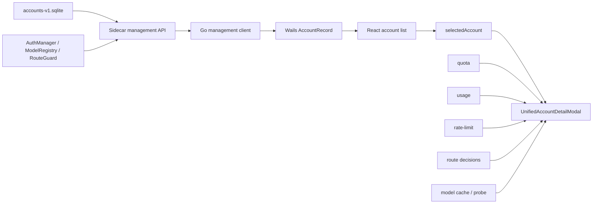

# 账号与账号详情机制优化方案报告

> 完整施工方案见 `account-detail-optimization-implementation-plan.md`。本文保留调查、方案比较和智者裁决。

## 结论

账号系统下一阶段采用“契约分层”，不继续扩张统一 `AccountRecord`：

1. 列表只消费无敏感字段的 `AccountSummary`。
2. 打开详情时按 `account_key` 获取 `AccountDetailEnvelope`。
3. 详情中的资产、运行态和补充数据明确区分来源、版本与新鲜度。
4. 后续编辑命令使用 `expected_revision` 做乐观并发控制，并把同一次账号配置保存收敛为单次原子 mutation。

分期顺序固定为：

1. T1：安全读模型。
2. T2：原子编辑与 revision CAS。
3. T3：补充数据 freshness 与详情聚合治理。

首期只执行 T1。T2、T3 不混入首期，避免同时改动读链路、写链路和所有补充数据。

## 目标

- 列表响应默认不携带 API key、cookie、headers、curl 脚本等敏感配置。
- 账号详情不再把列表对象当作完整编辑对象。
- 账号详情能够说明每类数据来自哪里、何时获取、是否陈旧、为何失败。
- 并发保存不会静默覆盖其他窗口或后台操作已经写入的账号版本。
- 资产保存成功、runtime apply 成功和详情刷新成功被视为三个不同结果。
- 保持 sidecar 对 SQLite 和 runtime 的现有所有权，不重做 runtime 架构。

## 非目标

- 不重做账号列表和详情视觉设计。
- 不改变 account-store SQLite owner。
- 不把 quota、usage、rate-limit、route guard 迁移到 Wails 或前端。
- 不要求详情首期成为后端生成的全局原子快照。
- 不在首期统一所有 supplement 调度、重试、退避和批处理。
- 不在首期删除全部旧 DTO；允许受控双轨迁移。
- 不把 `status` 扩展成新的全局状态机。

## 调查方法

本报告核对了以下链路：

- sidecar account-store schema、management list/detail/patch。
- Go management client 和 Wails `AccountRecord` 映射。
- frontend 列表缓存、详情选择、详情保存和补充数据聚合。
- 现有账号 hardening、详情系统和账号身份文档。
- 外部 CLI advisor：GitHub Copilot CLI。

Antigravity CLI 本轮调用正常退出但没有返回顾问文本，不计入有效 advisor 反馈。

## 当前机制



当前详情不是独立后端对象：

1. 列表加载 `AccountRecord[]`。
2. 点击卡片后把当前列表对象设置为 `selectedAccount`。
3. 详情 modal 从 `selectedAccount` 初始化配置 draft。
4. quota、usage、rate-limit、route decision、models 分别异步注入。
5. 保存后先局部 patch 列表对象，再调用 `ListAccounts` 刷新。

该方式在单窗口、低并发和接口稳定时可工作，但列表契约、编辑契约和运行态展示被压进同一个大对象。

## 证据矩阵

| 候选问题 | 问题来源 | 代码事实位置 | 当前现象 | 可证伪条件 | 预期验收 |
| --- | --- | --- | --- | --- | --- |
| 列表契约携带敏感字段 | 代码审计 | `internal/accounts/account_records.go`、`internal/wailsapp/accounts.go` | 实时 `ListAccounts` 可把 API key、headers、cookie、curl variables、model fetch key 送入 WebView | 实际 list JSON 已无这些字段 | 字段级测试证明 list/snapshot 均零 secret |
| 降级 warning 丢失 | sidecar/API client 对照 | sidecar `accounts_store.go`、`internal/cliproxyapi/types.go`、`client.go` | sidecar 返回 `degraded/warning`，Go client 只解析 `accounts` | client 已解析并向 UI 暴露 warning | 契约测试覆盖 degraded list |
| 详情依赖列表对象 | 前端链路审计 | `AccountsFeature.tsx`、`accountDetailSelection.ts` | 打开详情不请求独立 detail，编辑字段来自 `selectedAccount` | 打开详情已调用独立 detail API | DOM/调用测试证明 list summary 无 secret 仍可完整编辑 |
| revision 未进入 UI | DTO 对照 | sidecar `UnifiedAccount.Revision`、Wails `AccountRecord`、frontend `AccountRecord` | DB revision 存在，但 Wails/frontend 丢失 | detail state 已携带 revision | detail contract 测试断言 revision |
| 整对象 PATCH 有覆盖风险 | 写链路审计 | Wails `UpdateCodexAPIKeyConfig`、`UpdateOpenAICompatibleProvider`、sidecar `UpdateAccount` | Wails 先 GET 再整体 PATCH；API 无 `expected_revision` | API 已有 CAS 或不存在并发写入口 | 并发测试证明 stale revision 不写入 |
| Codex 保存可部分成功 | 写链路审计 | `useAccountsActions.ts` | label 和 config 分两次 PATCH，产生两个 revision/apply 周期 | 已合并为单次 mutation | 单事务、单 revision 测试 |
| 详情补充数据缺统一 freshness | 前端聚合审计 | `AccountsFeature.tsx` modal props | 各模块有独立状态，但没有统一 source/fetchedAt/stale/error | 所有模块已有统一 envelope | 部分失败和陈旧数据测试 |
| provider 展示语义会被前端改写 | 映射审计 | `accountPresentation.ts` | `provider=codex` 时可依据 base URL 直接改写 provider | sidecar 已输出 display provider 或前端只生成独立 display label | provider 字段不再被 mapper mutation |

## 核心问题

### 1. `AccountRecord` 职责过载

当前 Wails `AccountRecord` 同时包含：

- 账号身份和展示字段。
- runtime routeability 和 repair evidence。
- API key、API key 列表、headers、platform cookie。
- models、format base URLs、proxy、quota/billing curl。
- quota key、auth index、requestability。

结果是任何列表消费者都获得详情编辑所需的完整数据面。新增字段时也很难判断它属于资产、运行态、编辑态还是补充数据。

### 2. 列表降级不可观测

sidecar 在 credential 行读取失败时会降级返回：

```json
{
  "accounts": [],
  "degraded": true,
  "warning": "..."
}
```

Go `UnifiedAccountsResponse` 目前只有 `accounts`。Wails 和前端无法区分“完整列表”与“card-only 降级列表”，可能把缺失 credential 的详情当作正常数据。

### 3. 详情是最终一致聚合，但缺少显式语义

详情中的各模块可能来自不同时间点：

- asset/runtime：最近一次账号列表读取。
- quota：quota cache 或刷新任务。
- usage：usage snapshot。
- rate-limit：规则和运行态查询。
- route decisions：独立 channel routing snapshot。
- models：账号配置、缓存、catalog 或 probe。

详情允许最终一致，但必须把这种事实显式化，不能让用户误以为所有模块属于同一个原子快照。

### 4. revision 已存在但没有形成并发契约

SQLite `account_cards.revision` 在完整账号更新时递增，runtime apply state 也按 revision 对齐。但当前：

- Wails `AccountRecord` 不携带 revision。
- frontend `AccountRecord` 不携带 revision。
- PATCH 不接受 `expected_revision`。
- stale editor 可以覆盖更新后的账号。

### 5. 保存结果被压缩成“成功或失败”

真实保存至少包含三种结果：

1. 资产是否写入 SQLite。
2. 对应 revision 是否成功 apply 到 runtime。
3. 保存后详情和列表是否刷新成功。

当前 UI 容易把 runtime apply 失败或 refresh 失败解释成整个保存失败，或反过来把资产成功误表述为已经可请求。

## 目标契约

### AccountSummary

用于列表、筛选、分组、排序和首屏缓存。

必需字段：

```text
accountKey
accountKind
title
provider
credentialSource
priority
disabled
revision
updatedAtUnixMs
planType
runtimeEvidence
keyFingerprint / keySuffix（仅非敏感摘要）
configuredModelCount
```

禁止字段：

```text
apiKey
apiKeys
authJSON
headers
platformCookie
curlVariables
quotaCurl
billingCurl
modelFetchAPIKey
```

`AccountSummary` 可以携带模型数量和能力摘要，但不携带完整编辑配置。

### AccountDetailEnvelope

打开详情时按 `account_key` 获取。

```text
asset
editable
runtimeEvidence
warnings
degraded
fetchedAtUnixMs
```

其中：

- `asset`：稳定身份、kind、provider、title、priority、disabled、revision、updatedAt。
- `editable`：按 `accountKind` 返回的 typed credential/config。
- `runtimeEvidence`：纯展示运行态证据。
- `warnings/degraded`：账号详情是否使用了降级读取。
- `fetchedAtUnixMs`：该 detail envelope 的生成时间。

首期不把 quota、usage、rate-limit 强行塞进 detail API。它们继续异步加载。

### RuntimeEvidence

```text
applyStatus
applyError
routeabilityStatus
routeabilityReason
failureClass
registeredModelCount
repairOutcome
repairAction
lastRepairAtUnixMs
routeable
```

约束：

- evidence 不覆盖 asset identity。
- route guard overlay 可以改变响应中的 routeability evidence，但不能从 GET 写回 SQLite。
- `applyStatus=applied` 不等于最终 requestable。

### SupplementEnvelope<T>

T3 使用，首期只预留前端类型方向：

```text
source
fetchedAtUnixMs
expiresAtUnixMs
stale
loading
error
data
```

`error` 至少包含：

```text
code
message
retryable
```

### MutationResult

T2 使用：

```text
accountKey
assetSaved
previousRevision
newRevision
updatedAtUnixMs
runtimeApplyStatus
runtimeApplyError
warnings
```

revision 冲突单独返回：

```text
code = account_revision_conflict
expectedRevision
currentRevision
currentUpdatedAtUnixMs
```

## 路线选择

### 方案 A：契约分层

`AccountSummary + AccountDetailEnvelope + revision mutation`

优点：

- 安全默认。
- 明确列表、详情、运行态、补充数据的责任。
- 允许逐步迁移。
- 便于加入 CAS 和部分失败语义。

缺点：

- 过渡期会有新旧 DTO 双轨。
- Wails binding 和前端类型需要同步迁移。

结论：采纳。

### 方案 B：继续扩张 AccountRecord

优点：

- 短期文件改动少。

缺点：

- 继续固化敏感字段、运行态和列表展示耦合。
- 无法建立清晰的数据访问边界。
- 后续 supplement 和 CAS 仍会挤入同一对象。

结论：拒绝作为目标架构，只允许作为迁移适配层。

### 方案 C：前端 aggregate store 负责一致性

优点：

- UI 可以自行控制并发和模块刷新。

缺点：

- 把事实解释和版本一致性下放 WebView。
- 与 sidecar runtime authority 冲突。
- 难以审计 route guard、revision 和 apply 结果。

结论：拒绝。前端可以管理 view state，不管理账号真源一致性。

## 分期方案

### T1：安全读模型

这是第一刀。

#### 范围

1. sidecar `GET /accounts` 和 snapshot 返回 summary DTO，不返回 secret。
2. 新增显式账号详情 read endpoint，返回 `AccountDetailEnvelope`。
3. list/detail response 都保留 `degraded/warning`。
4. Wails 新增 summary/detail DTO 和 detail binding。
5. 打开账号详情时按需读取 detail。
6. 详情 draft 只从 detail editable 配置初始化。
7. detail state 携带 revision，但本期不用于写入冲突判断。

#### 暂不做

- 不修改 PATCH 并发语义。
- 不合并 Codex label/config 两次保存。
- 不统一 quota/usage/rate-limit envelope。
- 不改变详情视觉结构。

#### Tracer bullet

选择一个 Codex API key fixture，证明：

```text
SQLite full account
  -> GET /accounts summary 无 secret
  -> Wails AccountSummary
  -> React 列表正常展示
  -> 点击详情调用 GetAccountDetail(account_key)
  -> detail draft 获得可编辑 credential + revision
  -> 现有保存仍能完成
```

完成这一条后，再扩展 auth-file 和 openai-compatible。

#### T1 验收

1. sidecar list 和 snapshot 的序列化字段级断言证明零 secret。
2. 列表排序、筛选、分组、禁用、删除仍只依赖 summary。
3. 打开详情只按稳定 `account_key` 获取 detail。
4. 详情可编辑字段只来自 detail，不从 list summary 回填。
5. detail 的 revision、updatedAt、degraded、warning 能到达 frontend。
6. detail partial read failure 显示明确错误，不使用残缺 summary 伪装完整详情。
7. 关闭和 hash 恢复保持现有行为。
8. 现有保存、启停和删除链路不回退到列表 secret。

### T2：原子编辑与 revision CAS

#### 范围

1. mutation 接受 `expected_revision`。
2. sidecar 在同一事务中检查 revision 并写入。
3. Codex API key 的 title/config 合并为一次 mutation。
4. Wails 不再先 GET 完整账号再拼整体 write。
5. mutation 返回结构化 `MutationResult`。
6. UI 保存冲突时保留本地 draft，不静默覆盖。

#### 失败语义

- revision 不匹配：返回 409 / `account_revision_conflict`，零写入。
- asset 保存成功、runtime apply 失败：返回 asset success + apply failed。
- 保存成功、刷新失败：使用 mutation result 局部更新 revision，详情标记 stale 并允许重试。

#### T2 验收

1. stale revision 更新返回 conflict，DB 和 runtime 均不改变。
2. 正确 revision 更新后只增加一次 revision。
3. Codex title/config 不再出现中间版本。
4. runtime apply 失败不回滚已成功资产写入。
5. 前端冲突保留 draft，并能刷新当前版本后重试。

### T3：详情补充数据治理

#### 范围

1. quota、usage、rate-limit、route decision、models 使用统一 `SupplementEnvelope<T>`。
2. 每个模块显示 source、fetchedAt、stale/error。
3. 模块失败互不阻断。
4. 建立 bounded detail cache 和刷新策略。

#### T3 验收

1. 单个 supplement 失败时 asset/detail 仍可使用。
2. stale 数据不会被显示为 live。
3. route guard、quota 和 runtime evidence 的冲突有明确解释顺序。
4. 详情缓存以 `account_key + revision` 失效。

## 失败行为

### 详情主体失败

- 不打开可编辑详情。
- 保留列表 summary。
- 显示 detail load error 和重试入口。
- 不从 summary 构造假的 credential draft。

### 详情补充模块失败

- 主体详情和编辑继续可用。
- 失败模块显示 source、最后成功时间、错误摘要和重试。
- 不清空其他成功模块。

### Revision 冲突

- 不覆盖 sidecar 当前版本。
- 保留本地 draft。
- 展示 expected/current revision 和刷新入口。
- 用户完成对比后再次保存。

### Runtime apply 失败

- 明确显示“资产已保存，运行态未生效”。
- 使用新 revision 更新详情。
- 提供显式 reconcile/apply 重试。
- 列表显示 degraded evidence，而不是把资产保存描述为失败。

### 保存后刷新失败

- 以 `MutationResult` 的 revision 和 updatedAt 更新最小本地状态。
- 标记详情 stale。
- 不撤销“资产已保存”的结果。
- 后台或用户操作重试 detail refresh。

## 测试策略

### Sidecar

- list/snapshot JSON 不含所有 secret 字段。
- detail 返回 typed editable credential 和 revision。
- list credential read 降级时 `degraded/warning` 保留。
- detail read 不触发 apply/refresh/probe。
- T2 增加 CAS 命中、冲突、并发和单 revision 测试。

### Go client / Wails

- `AccountListResponse` 解析 `degraded/warning`。
- summary mapper 不生成 secret 字段。
- detail envelope mapper 保留 revision 和 typed credential。
- Wails list binding 与 detail binding 契约分离。
- snapshot sanitizer 不再承担“修复实时列表泄密”的责任。

### Frontend

- 只给 summary fixture 时列表完整渲染。
- 打开详情触发 detail load。
- detail loading/error/retry/hash restoration。
- detail draft 不从 summary secret 初始化。
- detail cache 按 account key 和 revision 失效。
- T2 覆盖 conflict draft preservation。
- T3 覆盖 supplement partial failure 和 stale 标记。

### 证据过弱

以下证据不能单独作为完成证明：

- 手工打开详情看起来正常。
- 只断言 HTTP 200。
- 只检查 localStorage 已脱敏。
- 只有前端 mock，没有 sidecar 字段级序列化测试。
- 没有并发测试就宣称解决覆盖写。
- asset 保存成功后只看列表更新，不检查 runtime apply result。

## 风险与缓解

| 风险 | 缓解 |
| --- | --- |
| 新旧 DTO 双轨造成维护成本 | 先迁移 accounts 页面 tracer bullet，再迁移 Codex/Claude account-list 消费点 |
| detail 按需读取增加一次调用 | 对同一 `account_key + revision` 使用有界内存 cache |
| 首期尚无 CAS | revision 已进入 detail；在 T1 完成前不宣称解决并发覆盖 |
| supplement 仍可能陈旧 | 首期明确不宣称原子详情；T3 再统一 freshness |
| 老 sidecar 不支持 detail endpoint | dev/release 同步升级；不在前端伪造兼容详情 |
| summary 字段不足导致列表回读 detail | 用现有筛选/排序测试反推 summary 最小字段，不把 secret 重新加回 summary |

## Advisor 反馈与裁决

### 第一轮

- Advisor/source：GitHub Copilot CLI，外部只读咨询。
- 原始立场：`A > B > C`，只选择 A 作为目标架构。
- 最强 challenge：在巨型 `AccountRecord` 上补字段会固化耦合；一致性不能下放前端 store。
- 最强建议：列表无 secret、独立详情、revision CAS、原子保存、补充数据 envelope。

裁决：

- 采纳契约分层。
- 拒绝继续扩张统一 `AccountRecord`。
- 拒绝让 frontend aggregate store 成为账号一致性 owner。
- 认为第一轮给出的第一刀仍过宽，继续追问。

### 第二轮

- Advisor/source：GitHub Copilot CLI，外部只读咨询。
- 原始立场：在 T1/T2/T3 中只选择 T1。
- 最强 challenge：先做 CAS 会让列表 secret 暴露继续存在；先做 supplement 只能改善可观测性，不能证明契约分层。
- 最强建议：先证明 `summary -> detail` 读模型分层和安全默认，再进入写链路。

裁决：

- 采纳 T1 为第一刀。
- T2 推迟到 summary/detail 稳定后。
- T3 推迟到写入契约稳定后。
- 不接受“已有 localStorage sanitizer，所以列表敏感字段问题已经解决”的说法。

## Final Verdict

- Background：底层账号 hardening 已完成，剩余主要风险集中在巨型读模型、详情聚合、敏感字段暴露和编辑并发。
- Goal：建立安全默认、可演进、可观测的账号列表/详情/编辑契约。
- First slice：T1 安全读模型，完成 `AccountSummary -> AccountDetailEnvelope` tracer bullet。
- Must include：列表零 secret、独立详情、revision 透传、degraded/warning 透传、现有列表和保存行为回归。
- Must exclude：CAS、全量 supplement envelope、视觉重做、runtime 重构。
- Chosen tradeoffs：接受短期 DTO 双轨和一次额外 detail 调用，换取长期契约清晰与敏感字段缩窄。
- Failure behavior：详情主体失败不伪造编辑态；模块失败局部降级；后续 mutation 明确区分 asset saved、runtime apply、refresh。
- Evidence/proof standard：sidecar 字段级测试、Wails 契约测试、前端 detail load/error/hash 测试和完整回归。
- Tests/acceptance：以 Codex API key 端到端 tracer bullet 为首个验收，再扩展 auth-file 和 openai-compatible。
- Feedback:
  - Advisors consulted：GitHub Copilot CLI；Antigravity CLI 无有效文本，不计入。
  - Adopted：方案 A、T1 首期、安全默认、独立 detail、revision 进入详情。
  - Rejected：巨型 `AccountRecord` 补丁化、前端一致性 owner、首期同时改读写和全部 supplement。
  - Deferred：CAS 原子编辑、统一 supplement freshness、旧 DTO 清退。
  - Follow-up triggers：T1 字段契约稳定且保存不再依赖列表 secret 后进入 T2。
- Accepted risks：首期仍存在并发覆盖可能；supplement 仍是最终一致。
- Deferred work：T2、T3 及旧 DTO 清理。
- Upgrade triggers：发现 stale editor 覆盖、保存部分成功、详情 stale 比例高、或任何 secret 仍进入列表/WebView cache。
- What not to claim：T1 完成后不得宣称已经解决并发覆盖、详情原子一致性或 runtime apply 成功率。

## 当前状态

- 状态：implemented
- 最近更新：2026-07-11

## 实施后修订

原报告的 T1/T2/T3 分期用于控制首刀风险，后续已按完整方案继续执行，不再停留在 T1：

- T1：列表安全 summary、按需 detail、revision 透传已完成。
- T2：mutation CAS、权威 mutation result、冲突提示与 detail reload 已完成。
- T3：quota/rate/usage/route 保持独立 freshness/decision anchor；自动资源读取按账号/资源 singleflight，event/inventory revision 负责资产集合增量收敛。
- legacy public full-record 链已关闭；backend-only full record consumer 保留在 Go 内部，不进入 WebView。

因此原文中“首期不做 CAS”“T1 完成后不得宣称解决并发覆盖”等描述仅代表当时首刀边界，不再代表当前实现状态。当前仍不宣称跨 quota/rate/usage/route 的原子快照；系统采用可观测的最终一致。
