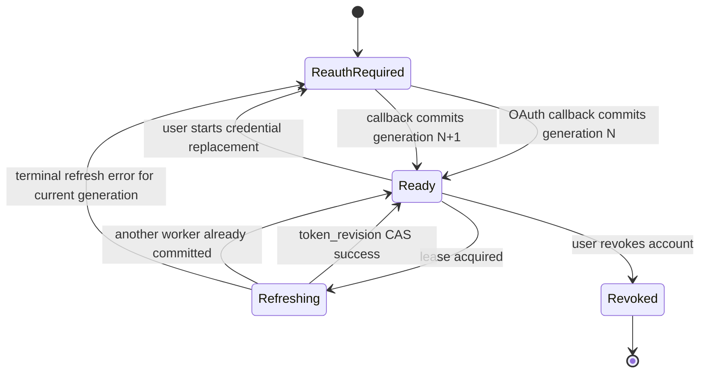

# Account Runtime Authority V2

## 状态

- 方案状态：R1 implemented，R2 runtime facts foundation implemented
- 决策日期：2026-07-11
- 目标版本：GetTokens 2.0
- 实施前提：用户明确授权不保留历史运行兼容
- 实施边界：先在 dev profile、测试 DB 和本仓 sidecar 落地；未经授权不修改正式版

## 2026-07-11 实施进度

R1 原子切换链路已完成：

1. GetTokens 生成 sidecar config 时改用 `accounts-v2.sqlite` 与 `runtime-v1.sqlite`。
2. sidecar 启动监听前完成 v2 receipt 校验、v1 一次迁移或空库初始化；失败时 fail-closed。
3. 新增 `accountstorev2`、一次性 migrator 和 runtime compiler；runtime auth ID 固定为 `acctrt:<account_key>:g<generation>`。
4. watcher、auth-dir、config credentials 和 generic token store 不再向配置了 account-store 的 runtime 枚举账号。
5. OAuth refresh 使用 generation/revision/进程 epoch lease；迟到旧代结果被丢弃。
6. OAuth token 写回新增 `SaveRefreshCAS(previous, updated)`，SQLite CAS 成功后才允许更新内存、scheduler 和 hook。
7. route guard v2 按 `account_key + credential_generation + runtime_auth_id` 归属；旧代事件和同 provider identity 的其他账号默认不受影响。
8. management `GET /accounts` 与 `GET /accounts/:account_key` 已具备 v2 纯读投影；旧 repository 被禁止打开 `accounts-v2.sqlite`。
9. openai-compatible 多密钥在迁移阶段拆成多个独立账号，避免一个资产编译成多个 runtime auth。
10. management create/update/delete/status/priority/batch/preview/reconcile、quota 辅助读取和 OAuth callback 全部具备 v2 repository 路径；mutation 使用 revision CAS。
11. OAuth callback 命中既有账号时通过 `CommitOAuthCredential` 提交下一代 credential，generation 递增、token revision 归零；新账号直接创建 generation 1。
12. `runtime-v1.sqlite` 已落地 generation-owned guard facts 与 quota snapshots；恢复和 GC 只接受当前 generation。
13. sidecar 和 Wails 均不再反序列化、hydrate、路由消费或写回 channel routing `runtimeStates`；旧字段在下一次策略保存时被移除。
14. doctor、Wails DTO、frontend account model 已透传 `credential_status`、`credential_generation` 和 revision；`reauth_required` 不再误判为 routeable。
15. 完成 sidecar 全量测试、根仓全量 Go 测试、frontend 1137 项 unit/typecheck/build、Wails production build和隔离 `/private/tmp` profile smoke。

R2 后续增强不阻塞 R1：

1. rate-limit 规则、reservation 和事件目前仍使用 sidecar 自有 SQLite；未迁入 `runtime-v1.sqlite`，但不再依赖 channel JSON。
2. route decision summary、doctor observation 的 bounded persistence 仍按后续可观测性收益推进。
3. live session、WebSocket pin 和 refresh lease 按裁决继续只保存在内存。

## 最终裁决

采用一次性破坏性切换：

1. 新建 `accounts-v2.sqlite`，只保存账号资产、凭证和低频配置，是账号真相唯一来源。
2. 新建 `runtime-v1.sqlite`，只保存可恢复的 route guard、quota、rate-limit 和诊断事实。
3. live session、WebSocket pin、refresh in-flight lease 只保存在内存，不落 SQLite。
4. sidecar runtime 只从 `accounts-v2.sqlite` 编译账号，不再从 `auth-dir`、JSON 文件、旧 config 或 `FileTokenStore.List()` 发现 GetTokens 账号。
5. 首次切换时只迁移 API key、openai-compatible 和账号元数据；OAuth 不复制旧 refresh token，统一进入 `reauth_required`。
6. 迁移成功后单读 v2；迁移失败 fail-closed，不回退 v1、不双读、不通过 GET 隐式迁移。
7. route guard 所有权绑定 `account_key + credential_generation + runtime_auth_id`。provider identity 默认不得跨账号阻断。
8. 删除 channel routing JSON 中的 `runtimeStates`。channel routing 文件只保存策略，不保存运行事实。

这不是 `accounts-v1` 的继续打补丁，而是重新定义 GetTokens 账号运行态的授权边界。

## 为什么必须重做

本轮事故已经证明，仅靠排除 `migration-backups` 或扩大 guard 清理范围不能建立长期正确性：

- 同一凭证可从 account-store、FileTokenStore、watcher、config synthesizer 多路径进入 runtime。
- runtime auth id 可能来自文件名、稳定哈希或账号 key，无法成为可靠所有权主键。
- provider identity 同时承担 refresh 去重、相关性查询和 route guard 传播，职责过载。
- route guard 运行事实写入 channel routing 策略 JSON，导致策略与运行状态互相污染。
- OAuth refresh 的迟到结果即使最终 CAS 失败，也可能先写 guard、quota 或 session 副作用。
- doctor 能发现 runtime orphan，但当前架构不能从构造上禁止 orphan。

目标不是“更容易清理旧状态”，而是让旧状态没有资格影响新代际。

## 架构总图

```mermaid
flowchart LR
  UI["Frontend account views"] --> Wails["Wails bindings"]
  Wails --> API["Sidecar management API v2"]
  API --> AssetDB["accounts-v2.sqlite"]
  API --> RuntimeDB["runtime-v1.sqlite"]

  AssetDB --> Compiler["Account runtime compiler"]
  Compiler --> Snapshot["Compiled runtime snapshot"]
  Snapshot --> AuthManager["Auth manager / model catalog"]
  AuthManager --> Router["Scheduler / route policy"]
  Router --> Upstream["Provider upstream"]

  Upstream --> Facts["Guard / quota / rate facts"]
  Facts --> RuntimeDB
  RuntimeDB --> Router

  AuthManager --> Memory["In-memory leases / live sessions / WebSocket pins"]

  Legacy["v1 DB / auth-dir / config credentials"] -. "migration input only" .-> Migrator["One-shot migrator"]
  Migrator --> AssetDB
  Legacy -. "forbidden at runtime" .-> AuthManager
```



## 不变量

以下不变量高于具体 API 和实现方式：

1. 每个 active account 在当前代际恰好有一个 current runtime auth。
2. 每个 runtime auth 必须映射到 `accounts-v2.sqlite` 中存在且 active 的账号。
3. GetTokens runtime credential source 数量恒为 1：`accounts-v2.sqlite`。
4. `auth-dir` 中新增、修改或删除 JSON 不得改变 GetTokens runtime。
5. 旧 `credential_generation` 的 refresh、guard、quota、rate-limit、session 事实不得影响当前代际。
6. OAuth token 更新只能在 `token_revision` CAS 成功时提交。
7. CAS 失败的 refresh 结果不得留下任何 guard、quota、rate-limit 或 credential 副作用。
8. provider identity 只用于相关性、singleflight 和上游全局事件索引，不是账号所有权。
9. channel routing policy 只能影响候选规则，不能成为 runtime facts 存储。
10. management GET 只读，不迁移、不 reconcile、不 refresh、不 probe。

## 数据库边界

### `accounts-v2.sqlite`

保存低频、强一致、需要备份的资产：

- account card
- credential envelope
- credential generation
- token revision
- provider identity
- configured models、proxy、priority、disabled
- OAuth reauth state
- asset revision、inventory revision
- migration receipt

不保存：

- route guard
- quota/rate-limit 热事实
- live session
- WebSocket pin
- request result history
- route decision history

### `runtime-v1.sqlite`

保存可丢弃、可重建、带 TTL 的运行事实：

- route guard event
- quota fact
- rate-limit fact
- bounded refresh trace
- bounded route decision summary
- doctor observation

每条记录必须携带：

- `account_key`
- `credential_generation`
- `runtime_auth_id`
- `source`
- `observed_at`
- `expires_at` 或明确 retention

运行决策读取 runtime facts 时，先从内存中的 current account snapshot 获取当前 generation，只接受同代记录。旧代记录可以异步 GC，但即使未删除也不得生效。

### 仅内存状态

- refresh in-flight lease
- live sessions
- WebSocket pin
- request-scoped reservation
- current compiled runtime snapshot

这些状态没有跨重启恢复价值。重启后通过账号资产和上游事实重新建立，避免高频 SQLite 写放大。

## 资产模型

### `accounts`

建议字段：

| 字段 | 语义 |
| --- | --- |
| `account_key` | 稳定资产 ID，创建后不变 |
| `kind` | `oauth` / `api_key` / `openai_compatible` |
| `provider` | 标准 provider key |
| `label` | 用户展示名 |
| `disabled` | 用户资产开关 |
| `priority` | 路由优先级 |
| `credential_status` | `ready` / `reauth_required` / `revoked` |
| `credential_generation` | 用户替换凭证或重新登录时递增 |
| `revision` | 账号资产 CAS revision |
| `created_at` | 创建时间 |
| `updated_at` | 最近资产变更时间 |
| `deleted_at` | soft-delete；runtime 不编译 deleted account |

### `credentials`

每个账号只允许一条 current credential：

| 字段 | 语义 |
| --- | --- |
| `account_key` | 外键 |
| `credential_generation` | 与账号 current generation 一致 |
| `credential_type` | `oauth` / `api_key` |
| `secret_payload` | 凭证 envelope；management read 永不返回 |
| `provider_identity` | 上游账号标识，仅做相关性 |
| `token_revision` | 同代 OAuth token 轮换序号 |
| `access_expires_at` | access token 过期时间 |
| `last_refresh_at` | 最近成功 refresh |
| `created_at` | 本代凭证创建时间 |

唯一约束：

```text
UNIQUE(account_key, credential_generation)
CHECK(token_revision >= 0)
```

### `account_models`

显式配置模型单独规范化，不继续把复杂模型语义塞入通用 JSON：

- `account_key`
- `credential_generation`
- `model_name`
- `alias`
- `enabled`
- `source`
- `revision`

Codex OAuth 的官方模型 profile 可以由 resolver 计算，不写成伪显式配置。

### `migration_receipts`

记录一次性迁移的可审计结果：

- source DB hash
- source schema version
- started/finished time
- migrated/skipped/reauth-required count
- backup path
- migration binary version
- terminal status

迁移 receipt 成功后，后续启动不得再次读取 v1。

## 身份与版本语义

### `account_key`

账号资产所有权。删除后重新登录默认创建新 `account_key`；若产品明确选择“恢复同一资产”，也必须递增 generation。

### `credential_generation`

表示用户提供了一套新的凭证材料。以下动作递增：

- OAuth 重新登录
- API key 替换
- openai-compatible secret 替换
- credential revoke 后重新授权

以下动作不递增：

- access token 正常 refresh
- plan metadata 更新
- quota/rate-limit 更新
- 模型目录刷新

### `token_revision`

表示同一 generation 内 OAuth token 被成功轮换。每次 refresh CAS 成功后递增 1。

### `runtime_auth_id`

确定性派生：

```text
runtime_auth_id = "acctrt:" + account_key + ":g" + credential_generation
```

禁止使用：

- 文件名
- email
- provider identity
- token hash
- 列表位置

### `provider_identity`

允许用途：

- refresh singleflight key 的组成部分
- 诊断相同上游主体
- 上游明确 provider-level 全局封禁事件的相关性索引

禁止用途：

- 作为 runtime auth owner
- 默认跨账号 route guard
- 删除账号时批量清理其他账号
- 覆盖 account key 或 generation

## OAuth 状态机



### OAuth callback 事务

1. 校验 login session、state、provider。
2. 交换 token，但不写 runtime side effect。
3. 以账号资产 revision 做 CAS。
4. 写入新 credential envelope。
5. `credential_generation += 1`。
6. `token_revision = 0`。
7. `credential_status = ready`。
8. 提交事务后发布 `account_credentials_changed` event。
9. runtime compiler 编译新 snapshot；旧 generation 自动失效。

### Refresh lease

lease key：

```text
provider + provider_identity + credential_generation + process_epoch
```

`process_epoch` 是 sidecar 每次启动生成的随机 epoch，只用于内存 lease 和 trace，防止把上次进程的执行语义带入本次进程。

### Refresh CAS

refresh worker 开始时读取：

- account key
- credential generation
- token revision
- runtime auth id

提交时必须在 `accounts-v2.sqlite` 单事务内断言：

```text
current_generation = expected_generation
current_token_revision = expected_token_revision
credential_status = ready
account is active
```

成功后同时更新 token、expiry、last refresh 和 `token_revision + 1`。

失败或 CAS conflict：

- 不覆盖 credential。
- 不写当前代 guard。
- 不写 quota/rate-limit。
- 只追加一条 bounded refresh trace，标记 `discarded_stale_result`。

### 最危险竞态

旧 generation refresh 请求在新登录完成后迟到。防护不是“随后清理”，而是任何副作用都先校验 generation。旧结果连 guard 都没有写入资格。

## Route Guard V2

### 数据结构

| 字段 | 说明 |
| --- | --- |
| `event_id` | 唯一事件 ID |
| `account_key` | 所有者 |
| `credential_generation` | 所属代际 |
| `runtime_auth_id` | 所属 runtime auth |
| `source` | auth-error / quota-empty / rate-limit / upstream-error / manual-disabled |
| `scope` | account / model / provider-global |
| `model` | 可空 |
| `reason_code` | 结构化错误码 |
| `reason_summary` | 脱敏说明 |
| `observed_at` | 观测时间 |
| `expires_at` | 失效时间；terminal auth error 可为空 |
| `evidence_ref` | trace/response hash，不含 secret |

### 生效规则

一条 block 生效必须同时满足：

1. account 仍 active。
2. block generation 等于账号 current generation。
3. runtime auth id 等于当前派生值。
4. 未过期。
5. source 对当前 route scope 有阻断权。

### 跨账号阻断

默认禁止。

唯一例外是上游明确返回 provider-level 全局封禁，而且事件必须：

- `scope=provider-global`
- 有明确 provider error code
- 有 TTL
- 有审计 evidence
- 由独立 provider policy 判断，不通过普通 account guard lookup 扩散

`refresh_token_reused`、`invalid_grant`、quota empty、rate-limit 都不是 provider-global。

### 清理策略

- 重新登录不需要广泛删除 guard；generation 前进后旧 guard 自动失效。
- GC 只负责存储控制，不负责正确性。
- manual disabled 是资产字段，不再伪装成持久 guard；router 直接读取 compiled snapshot 的 disabled 状态。

## Runtime Compiler

### 输入

单次一致 snapshot：

- inventory revision
- active account rows
- current credential rows
- account models/config

### 输出

不可变 `CompiledRuntimeSnapshot`：

- `store_revision`
- `compiled_at`
- `pool_epoch`
- `auths_by_runtime_id`
- `runtime_id_by_account_key`
- `model_catalog_by_runtime_id`
- `provider_identity_index`

### 编译规则

- `credential_status != ready`：不生成可路由 auth，但生成 management evidence。
- disabled/deleted：不生成 route candidate。
- 每个 active ready account 最多生成一个 current runtime auth。
- 任一重复 account key/generation/runtime id 直接编译失败。
- 编译失败保留进程内上一个已提交 snapshot，并把 sidecar 标记为 `runtime_degraded`；重启时无可用 snapshot 则 fail-closed。

### 原子应用

1. 从 v2 DB 读取一致 snapshot。
2. 纯函数编译，不修改 AuthManager。
3. 校验 doctor invariants。
4. 一次性交换 runtime snapshot/pool epoch。
5. 新请求只见新 snapshot。
6. 已提交的普通请求允许完成；旧代 WebSocket pin 在下一请求边界释放。
7. disable/delete 可按策略立即取消 live session。

不再通过 watcher diff 一条条 register/update/remove GetTokens 账号。

## Management API V2

旧兼容路由不保留。建议收敛为：

### Read

```text
GET /v1/management/accounts
GET /v1/management/accounts/:account_key
GET /v1/management/accounts/:account_key/models
GET /v1/management/account-runtime/doctor
GET /v1/management/account-runtime/events
```

返回字段必须包含：

- account revision
- credential generation
- credential status
- runtime auth id
- compiled store revision
- runtime evidence freshness

不得返回 secret payload、refresh token 或完整 auth JSON。

### Command

```text
POST   /v1/management/accounts
PATCH  /v1/management/accounts/:account_key
DELETE /v1/management/accounts/:account_key
POST   /v1/management/accounts/:account_key/oauth-sessions
POST   /v1/management/oauth-sessions/:session_id/complete
POST   /v1/management/accounts/:account_key/refresh
POST   /v1/management/account-runtime/reconcile
```

所有 mutation 带 `expected_revision`。冲突返回：

```json
{
  "code": "account_revision_conflict",
  "current_revision": 42
}
```

OAuth refresh 如果已有 lease，返回同一 refresh operation id，不启动第二次 upstream call。

### 迁移状态

```text
GET  /v1/management/account-store/migration
POST /v1/management/account-store/migration/retry
```

retry 只允许在尚未生成成功 receipt 且 v2 未进入 active 状态时执行。普通 GET 不触发迁移。

## 一次性迁移

### 迁移选择

| v1 类型 | v2 处理 |
| --- | --- |
| Codex/Claude OAuth auth-file | 迁账号元数据；不迁 token；`reauth_required` |
| Codex/API key | 迁 secret 和配置，generation=1 |
| openai-compatible | 迁 secret、base URL、headers、models、quota/billing 配置，generation=1 |
| deleted account | 不迁 |
| runtime apply state | 不迁 |
| route guard/runtimeStates | 不迁 |
| quota/rate-limit/live session | 不迁 |
| migration backup JSON | 不读取 |
| legacy config credential | 不迁；只有 v1 account-store 记录可成为迁移输入 |

### 启动流程

1. 获取单实例 migration lock。
2. 如果存在成功 receipt，直接打开 v2。
3. 如果 v2 不存在，备份 v1 DB、WAL/SHM 和 auth-dir 索引清单。
4. 在临时路径创建 v2。
5. 读取 v1 account-store，执行规范化迁移。
6. 运行 schema、secret、generation 和 duplicate invariants。
7. 原子 rename 临时 DB 为 `accounts-v2.sqlite`。
8. 写成功 receipt。
9. 初始化空 `runtime-v1.sqlite`。
10. 启动 v2 runtime compiler。

任何一步失败：

- sidecar management 仅暴露 migration/doctor。
- 账号请求 fail-closed。
- 不读取旧 credential。
- UI 显示明确迁移失败，不伪装“暂无账号”。

### 回滚

最小回滚动作：

1. 停止新 sidecar。
2. 恢复迁移前 v1 DB、WAL/SHM 和旧 auth-dir 备份。
3. 回退旧版本二进制。
4. 不让旧版本读取 v2。

新版本不实现在线向后兼容或 v2 -> v1 反向迁移。

## 首期必须删除的旧机制

首期切换不能只让旧路径“暂时不用”，必须使其对 GetTokens 账号不可达：

1. 删除 `accountStoreTokenStore` 的 fallback `List/Save/Delete` 语义。
2. GetTokens builder 不再注册 `FileTokenStore` 作为 runtime credential store。
3. watcher 不再监听 GetTokens `auth-dir` JSON 来注册账号。
4. config/file synthesizer 不再生成 GetTokens Codex/API key/openai-compatible runtime auth。
5. 删除 account-store 不可用时回退旧 config credential 的分支。
6. 删除 auth id 基于文件名/稳定哈希的 GetTokens 路径。
7. 删除 `runtimeStates` 从 channel routing JSON 的读、写、hydrate。
8. 删除 route guard 按 provider identity 默认扩散的 lookup。
9. 删除 GET 隐式 migration/apply/reconcile。
10. 删除 management full auth-file 读写作为账号主入口。

保留通用 CLIProxyAPI 非 GetTokens provider 能力时，必须通过显式产品边界隔离，不能让通用 store 自动进入 GetTokens runtime pool。

## 分期实施

Credential source cutover 无法安全拆成多个线上 phase：只切 DB、不同时切 OAuth CAS 和 guard ownership，会制造一个新的半功能版本。因此第一阶段是一个协调发布单元，预计触及超过 30 个 sidecar 文件和 10 个 App/Wails/frontend 契约文件，应使用独立 worktree、subagent 分工和完整 release gate。

后续阶段可以独立合并；任何阶段都不能恢复旧 credential source。

### R1：V2 Authority 原子切换

目标：一次发布完成账号真源、OAuth 代际和最小 route guard ownership 切换。R1 上线后所有支持的账号类型必须可用，不依赖 R2。

必须同批完成：

- `accounts-v2.sqlite` schema/store
- 一次性 migrator
- API key/openai-compatible 迁移
- OAuth 元数据迁移为 `reauth_required`
- OAuth v2 login session/callback
- OAuth generation commit
- token revision CAS
- process epoch refresh lease
- stale refresh result及全部副作用丢弃
- v2 runtime compiler
- runtime snapshot 原子交换
- 最小 generation-aware in-memory route guard
- management v2 inventory/detail/mutation/OAuth 契约
- migration/doctor fail-closed 契约
- 同批删除旧 credential runtime discovery
- 禁止读取 channel routing `runtimeStates`

可用性：

- API key/openai-compatible 迁移后立即可用。
- OAuth 迁移后显示“需要重新登录”；完成一次登录后立即进入 v2 generation/CAS 生命周期。
- route guard 即使尚未进入独立 runtime DB，也必须在内存中按 generation 生效，不能继续按 provider identity 扩散。

回滚：

- 恢复 v1 备份 + 旧二进制。

### R2：Runtime Facts V2

目标：route guard、quota、rate-limit 从 channel JSON 和散落内存迁入版本化 runtime store。

范围：

- `runtime-v1.sqlite`
- generation-aware guard/quota/rate fact
- provider-global 独立 policy
- TTL/retention/GC
- channel `runtimeStates` 删除
- doctor runtime invariants

独立价值：

- R1 已有 generation-aware 内存 guard，系统可正确路由；R2 增加 runtime facts 的重启可观测性和诊断闭环。

### R3：Session 与路由代际闭环

目标：live session、WebSocket pin、usage attribution 全部携带 generation。

范围：

- pin key 改为 runtime auth id
- request boundary release
- disable/delete immediate prune
- usage attribution 只认 runtime auth owner
- route decision summary bounded persistence

### R4：旧代码物理清理与 API 收口

目标：删除仅为迁移保留的 v1 parser 和已废弃 management route。

前提：

- 至少一个稳定发布周期 migration 成功率达标。
- 支持的用户安装已生成 migration receipt。

注意：R4 删除的是离线 migrator 的 v1 解析依赖，不是 runtime 旧 source；runtime 旧 source 已在 R1 删除。

## R1 施工边界

R1 是一次协调式 breaking release，不能用“小改动”估算。建议按以下模块拆 subagent，但由主控统一集成同一 branch：

### Sidecar 资产与迁移

- `internal/gettokens/accountstore/`：改为 v2 schema 和 store，不继续演进 v1 表。
- `internal/gettokens/accountmigration/`：新增只读 v1 reader、backup、receipt 和原子 cutover。
- `internal/config/`：默认路径切到 `accounts-v2.sqlite` 和 `runtime-v1.sqlite`。

### Sidecar runtime authority

- `internal/gettokens/accountcompiler/`：新增纯函数 compiler 和 immutable snapshot。
- `sdk/cliproxy/service.go`：启动、reconcile、snapshot swap 改走 compiler。
- `sdk/cliproxy/account_store_token_store.go`：删除 fallback store；如无其他用途则整文件删除。
- `sdk/cliproxy/auth/conductor.go`：refresh lease、generation/revision CAS、stale result discard。
- `internal/gettokenshooks/route_guard.go`：改成 generation owner；provider identity lookup 默认不再阻断。

### 旧 source 删除

- `sdk/auth/store_registry.go` / builder：GetTokens 不再注册 FileTokenStore 为 runtime source。
- `internal/watcher/`：删除 GetTokens auth-dir/config credential synthesis 和事件注册。
- `internal/watcher/synthesizer/`：仅保留非 GetTokens 通用 provider 所需能力。
- `internal/gettokenshooks/channel_runtime_state.go`：停止 hydrate/persist runtimeStates；能删除则删除。

### Management 与 App 契约

- `internal/api/handlers/management/`：新增 v2 account、migration、OAuth session、doctor contract。
- 根仓 `internal/cliproxyapi/`：更新 client/types。
- 根仓 `internal/wailsapp/`：只消费 v2 management read model。
- `frontend/src/features/accounts/`：展示 `reauth_required`、migration failed 和 revision conflict。
- `internal/sidecar/`：配置路径和启动前迁移状态。

### 预计规模

- 新增两个 sidecar package：account migration、account compiler。
- 新增一个 runtime facts package在 R2。
- R1 预计修改 40 个左右文件；应按 schema/migration、runtime/OAuth、management/App 三组提交，小步保持 branch 可构建。
- R1 不创建第二套并存 UI；旧账号页面直接切 v2 DTO。

## R1 执行顺序

R1 是单个发布单元，但施工必须按以下七个可回归 commit slice 推进。中间 commit 只进入 feature branch，不单独发布。

### Slice 1：V2 Schema 与迁移器

先红灯：

- v1 API key/openai-compatible 可迁移到 generation 1。
- v1 OAuth 迁移后不存在 refresh token，状态为 `reauth_required`。
- migration receipt 幂等。
- failure injection 不留下可 active 的半成品 v2。

实现：

- v2 store
- read-only v1 reader
- backup/receipt/atomic rename

### Slice 2：Runtime Compiler

先红灯：

- 每个 active ready account 恰好一个 runtime auth。
- duplicate runtime id 拒绝 snapshot swap。
- DB read failure 保留上一健康 snapshot。
- 无上一 snapshot 的冷启动失败必须 fail-closed。

实现：

- immutable snapshot
- deterministic runtime auth id
- pool epoch
- atomic swap

### Slice 3：旧 Credential Source Kill Gate

先红灯：

- auth-dir 文件变更不改变 GetTokens auth count。
- FileTokenStore.List 返回历史凭证也不能进入 GetTokens pool。
- account-store 不可用时不得 fallback config/file credential。
- channel routing `runtimeStates` 不 hydrate。

实现：

- builder/source 注入删除
- watcher/synthesizer GetTokens 路径删除
- startup invariant：发现非 v2 GetTokens auth 直接拒绝启动 runtime

### Slice 4：OAuth Login、Generation 与 Refresh CAS

先红灯：

- login callback generation 递增。
- 同代 refresh 单飞。
- token revision CAS。
- 旧 generation 迟到结果不写 credential 和副作用。
- process epoch 不跨重启复用 lease。

实现：

- OAuth session command
- callback transaction
- refresh lease
- token CAS
- bounded refresh trace

### Slice 5：Generation-aware Guard

先红灯：

- 两账号共享 provider identity，普通 auth error 只阻断 owner。
- 旧 generation guard 不生效。
- provider-global 事件必须有明确 code、TTL 和 evidence。
- manual disabled 直接来自资产 snapshot，不写 guard。

实现：

- in-memory v2 guard index
- route policy 接入 generation
- legacy identity lookup 删除

### Slice 6：Management、Wails 与 Frontend 契约

先红灯：

- inventory/detail 不含 secret。
- `reauth_required` 可见且 OAuth action 可执行。
- migration failure 不显示成空账号。
- account revision conflict 不写 DB。
- GET 不触发 migration/reconcile/refresh。

实现：

- management v2 routes
- root client/types
- Wails binding
- account view model

### Slice 7：Tracer-bullet 与发布门禁

端到端场景：

1. 从含三类账号和 migration-backups 的 v1 fixture 启动。
2. 迁移完成，API key/openai-compatible 立即可路由。
3. OAuth 显示 reauth，完成一次真实或 mock browser callback。
4. refresh 成功并递增 token revision。
5. 注入旧 generation 迟到 refresh 和旧 JSON，当前账号保持可用。
6. doctor 五个核心计数为零。
7. 重启后只从 v2 重建相同 runtime snapshot。

## Mock Seam

| Slice | mock upstream facts | mock downstream / spy outputs |
| --- | --- | --- |
| 1 | v1 SQLite fixture、损坏 row、磁盘写失败 | v2 rows、receipt、backup、fail-closed state |
| 2 | v2 account snapshot、duplicate generation | compiled auth map、pool epoch、swap count |
| 3 | FileTokenStore 返回旧 auth、watcher JSON event | GetTokens runtime register count = 0 |
| 4 | OAuth callback、并发 refresh、迟到 refresh | generation、token revision、upstream call count、discard trace |
| 5 | account auth error、provider-global error、expired guard | deny runtime ids、effective guard count |
| 6 | management store/runtime fixtures | HTTP status、safe DTO、Wails DTO、frontend state |
| 7 | 完整 v1 fixture + mock OAuth/provider | migration report、route result、doctor invariants |

## BDD 场景

### 迁移与单源

1. Given v1 DB 和 auth-dir 同时存在，When R1 启动成功，Then runtime 只包含 v2 编译账号。
2. Given v2 已 active，When auth-dir 新增旧 OAuth JSON，Then runtime snapshot、pool epoch 和 auth count 不变。
3. Given migration-backups 含同 provider identity 的旧 token，When sidecar 启动，Then该文件不被读取且 doctor orphan 为 0。
4. Given OAuth v1 account，When migration 完成，Then v2 保留账号元数据但 credential 为 `reauth_required`，secret 中不存在旧 refresh token。
5. Given migration 中任一 invariant 失败，When sidecar 启动，Then账号请求 fail-closed 且旧 credential 不回退。

### Generation 与 refresh

6. Given generation N 的 OAuth 账号，When重新登录成功，Then generation 变 N+1、token revision 归零、旧 runtime auth 失效。
7. Given同账号两个并发 refresh，When upstream 可成功，Then upstream call count 为 1，token revision 只增加 1。
8. Given generation N refresh 已发出，When N+1 登录先提交，Then N 的迟到结果 CAS 失败且不写任何 guard/quota/rate 副作用。
9. Given token revision R 的两个 refresh 结果，When第一个提交 R+1，Then第二个不得覆盖 R+1。
10. Given terminal refresh error 属于当前 generation，When提交 auth-error fact，Then只阻断当前 runtime auth。

### Guard 与 runtime facts

11. Given旧 generation 的未过期 guard，When当前 generation 已前进，Then router 忽略旧 guard。
12. Given两个账号共享 provider identity，When其中一个 `refresh_token_reused`，Then另一个账号不被阻断。
13. Given provider-global 明确信号且 TTL 有效，When provider policy 执行，Then跨账号阻断可生效并可审计。
14. Given quota fact 已过期，When route selection，Then该 fact 不阻断候选。
15. Given channel routing JSON 含历史 `runtimeStates`，When新版本启动，Then不 hydrate、不写回、不影响 route。

### Runtime compiler 与会话

16. Given N 个 active ready accounts，When compile 成功，Then runtime 恰好有 N 个 current auth。
17. Given duplicate runtime auth id，When compile，Then拒绝交换 snapshot并保留上一份健康 snapshot。
18. Given账号 disabled/delete，When command 提交，Then新请求不再选中，相关 live session 按策略释放。
19. Given旧 generation WebSocket pin，When下一请求边界发生，Then pin 释放并重新选择 current auth。
20. Given DB 暂时读取失败且进程已有健康 snapshot，When reconcile，Then保留上一 snapshot 并标 degraded；不得从文件回退。

## Doctor 门禁

发布前以下指标必须为零：

1. `runtime_orphan_auths`
2. `active_accounts_without_current_runtime_auth`
3. `accounts_with_multiple_current_runtime_auths`
4. `effective_stale_generation_facts`
5. `channel_routing_runtime_states_loaded`

并必须满足：

- 所有 runtime fact 可追溯到有效 `(account_key, generation, runtime_auth_id)`。
- OAuth token revision 单调，无分叉。
- runtime compiler revision 不落后于最后成功 account mutation 超过一个 reconcile 窗口。
- auth-dir 变更不会引起 GetTokens pool epoch 变化。
- management inventory 不包含 secret 字段。

## 性能预算

R1 开工前固定基线，最低门禁：

- 1000 账号 startup compile p95 不高于 500 ms。
- 无资产变更时 reconcile 不写 `accounts-v2.sqlite`。
- route candidate hot path 不查询 SQLite，只读取内存 snapshot 和 bounded runtime fact index。
- runtime fact 写入按账号/source 合并，禁止每 token chunk 写库。
- `runtime-v1.sqlite` 默认 retention 有界，route decision 只存 totals + bounded samples。
- live session 和 WebSocket pin 内存条目有 TTL/终止清理，不随历史请求无限增长。
- doctor 扫描允许 O(accounts + active facts)，不得对每个账号发独立 SQLite 查询。

若基准证明 `runtime-v1.sqlite` 写入仍进入请求关键路径，改为 bounded async writer；丢失诊断事实可以接受，影响 route correctness 的当前 guard index必须先在内存同步更新。

## 测试与验证命令

每个实现 slice 遵循先红后绿：

```text
go test ./internal/gettokens/accountstorev2/...
go test ./internal/gettokens/runtimefacts/...
go test ./sdk/cliproxy/... -run 'AccountRuntimeV2|CredentialGeneration|RefreshCAS'
go test ./internal/api/handlers/management/... -run 'AccountV2|Migration|Doctor'
go test ./...
npm --prefix frontend run test:unit
npm --prefix frontend run typecheck
npm --prefix frontend run build
./scripts/wails-cli.sh build
docs-linhay/scripts/check-docs.sh
git diff --check
```

dev smoke：

1. 备份 `gettokens-dev`。
2. 从正式目录复制 v1 DB/config 到 dev，绝不启动正式版修改。
3. 启动新 dev sidecar 执行一次迁移。
4. 验证 API key/openai-compatible 可路由。
5. 验证 OAuth 全部 `reauth_required`。
6. 完成一个真实 OAuth 登录，验证 generation、runtime auth、refresh CAS。
7. 往 auth-dir/migration-backups 写入旧测试 JSON，验证 pool 不变。
8. doctor 五个零值全部通过。
9. 恢复原 dev 数据。

## 上线与发布

建议以 GetTokens `2.0.0` 发布，原因是：

- OAuth 账号需要重新登录。
- management API 和本地 DB 都发生破坏性变化。
- 旧 auth-dir credential runtime 入口被删除。
- 回滚依赖备份和旧二进制，不支持在线降级。

上线门禁：

- migration dry fixture 覆盖三类账号。
- migration failure injection 全部 fail-closed。
- 1000 账号 compile/perf budget 通过。
- doctor invariants 通过。
- dev App/Wails build 通过。
- 正式发布包只读预检能够显示将迁移数量和需重新登录数量。
- app 启动前完成自动备份，并向用户明确 OAuth 需重新登录。

## 明确不做

- 不保留 v1 runtime 双读。
- 不支持旧 App 连接新 management API。
- 不复制旧 OAuth refresh token。
- 不把 Keychain/envelope encryption 改造塞入 R1；它是独立安全项目。
- 不在 R1 重做账号卡视觉。
- 不把 provider identity 继续作为普通 route guard 扩散键。
- 不为上游 `refresh_token_reused` 增加本地重试。
- 不让 Wails/frontend 直接访问任一 sidecar SQLite。
- 不用 GC 或“登录后清理”承担正确性。

## 最脆弱假设

本方案假设用户接受一次 OAuth 全量重新登录，以换取彻底切断旧 refresh token 和历史文件凭证。

如果该假设不成立，唯一替代是复制旧 OAuth token 到 v2，但这会把当前事故中的不可信 refresh token 和来源歧义一并带入新系统，削弱 v2 切换价值。本方案明确拒绝该替代。

## 智者反馈处理

- Advisor：GitHub Copilot CLI，两轮只读咨询。
- 采纳：
  - `A > B > C`，选择新 v2 DB + 一次迁移后单读。
  - 资产库与高频 runtime facts 库分离，live/pin 只内存。
  - OAuth 只迁元数据，统一 reauth。
  - generation-aware guard 和 refresh side-effect CAS。
  - 首期同批删除旧 runtime credential source。
- 拒绝：
  - 将所有 runtime 热状态写入 `accounts-v2.sqlite`。
  - 首期切 v2、后续才删除旧 runtime source。
  - 完全清空所有 API key/openai-compatible 账号。
- 推迟：
  - credential Keychain/envelope encryption。
  - migrator v1 parser 的物理删除，放到稳定发布周期后的 R4。
