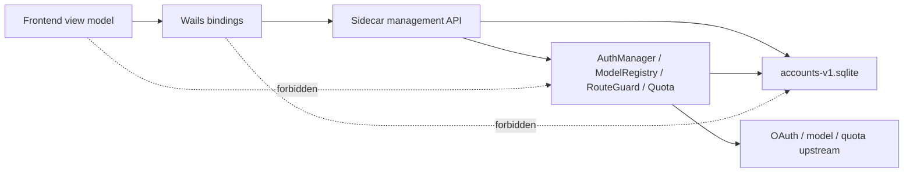

# Account System Hardening Technical Design

> 状态：v1 stabilization baseline。2026-07-11 用户授权破坏性重构后，下一阶段实施以 `account-runtime-authority-v2.md` 为准。本文件保留用于解释 Phase 0-9 已完成的止血和边界演进。

## 结论

采用 `sidecar DB 独占 + API 契约`。

GetTokens 的主账号库 `accounts-v1.sqlite` 只允许 sidecar 作为 owner 打开和演进。App/Wails 不再直接读取主 SQLite，也不写 runtime apply、route guard、model registry 或 quota/rate-limit 状态。App 只消费 sidecar management API 返回的资产 snapshot 与运行态 evidence。

本轮调查确认当前脆弱性不是单个字段映射错误，而是四类边界混在一起：

1. read path 带副作用：`GET /accounts` 会对 pending 账号触发 `applyPendingAccountStoreRuntime`；`GET /accounts/:account_key` 仍会对 pending 账号调用 `applyAccountStoreRuntime`。
2. App 绕过 sidecar 读主库：`ListCachedAccounts()` 直接以 read-only DSN 打开 `accounts-v1.sqlite` 做首屏 snapshot。
3. OAuth refresh 并发锁粒度过窄：`Manager.refreshAuthWithOptions()` 按 runtime `auth.ID` 加锁，不按 OpenAI/ChatGPT provider identity 加锁。
4. 模型能力有多套来源：runtime registry、account-store fallback、openai-compatible attributes、Codex static plan models 之间没有一个统一 resolver。

## 目标架构



## 状态所有权

| 状态 | Owner | 写入入口 | 读取入口 |
| --- | --- | --- | --- |
| account identity / kind / provider / disabled / priority | sidecar account-store | management command | management read |
| credential metadata / plan / configured models | sidecar account-store | management command / OAuth writeback | management read / runtime synthesis |
| runtime apply state | sidecar runtime reconcile | command / explicit reconcile / startup init | management read evidence |
| routeability / model registration count | sidecar runtime reconcile | command / explicit reconcile / model refresh | management read evidence |
| route guard / quota/rate-limit / live sessions | sidecar runtime | request result / refresh / quota job / command | management evidence / route engine |
| frontend cache | frontend | management read response only | first paint view model |

原则：资产态可以持久化，运行态只能由 sidecar 解释和更新，展示态不能反向成为真源。

## API 合约

### Read

Read path 必须幂等、无外呼、无 runtime apply、无 refresh、无 probe。

- `GET /v0/management/accounts`
- `GET /v0/management/accounts/:account_key`
- `GET /v0/management/accounts/:account_key/models`
- `GET /v0/management/gettokens/quota-status...`
- diagnostics / doctor read endpoints

允许 read path 做纯计算与脱敏 fallback，例如 Codex auth-file registry 为空时按 `plan_type` 返回静态模型列表；不允许把 fallback 写回 DB 或 registry。

### Command

Command path 可以写资产态并触发有界 runtime apply。

- create / batch-create
- patch credential / priority
- enable / disable
- delete / batch-delete
- explicit refresh

### Reconcile

Reconcile 必须显式暴露为 POST，带 trace id 和 bounded scope。

建议新增：

- `POST /v0/management/accounts/reconcile`
- `POST /v0/management/accounts/:account_key/reconcile`

请求字段：

```json
{
  "scope": "pending|routeability|models|all",
  "reason": "startup|user-action|doctor|test",
  "dryRun": false
}
```

响应字段必须包含 `event_id`、`changed_account_keys`、`apply_count`、`repair_count`、`duration_ms`、`errors`。

### Probe

Probe 是可外呼调试动作，必须使用 POST，不能隐藏在 GET 详情或模型读取里。

## 分期落地

### Phase 1：read path purity

第一刀只处理读写边界，不重构整套账号库。

- 移除 `GET /accounts` 中对 `applyPendingAccountStoreRuntime` 的调用。
- 移除 `GET /accounts/:account_key` 中对 pending 的隐式 apply，或改成只返回 `pending` evidence，并提示 explicit reconcile。
- 把 pending recovery 移到 startup init、create/patch command 和显式 `POST /accounts/reconcile`。
- 给 management handler 增加 spy hook 测试：
  - GET 列表不调用 apply hook。
  - GET 详情不调用 apply hook。
  - GET models 不调用 apply hook / refresh / probe。
  - GET 连续读取前后 DB runtime state 不变。

风险：历史崩溃遗留的 pending 账号不再靠打开页面自动修复。

缓解：sidecar 启动仍执行 `initializeAccountStoreRuntime()`；UI 提供“同步运行态”按钮调用显式 reconcile；doctor 可以提示 pending 数量。

### Phase 2：OAuth refresh provider-identity singleflight

当前 `refreshLocks` 以 runtime `auth.ID` 为 key。重复导入或复制账号时，同一个 OpenAI/ChatGPT `auth_json.account_id` 可能对应多个 `acct_*` / auth id，仍会并发刷新同一个上游 refresh token。

改造目标：

- 增加 `refreshLeaseKey(auth)`：
  - Codex OAuth/auth-file 优先 `provider + openai-account-id:<account_id>`。
  - 其次 `provider + auth.AccountKey`。
  - 最后 `provider + auth.ID`。
- `refreshAuthWithOptions()` 用 lease key 获取 singleflight/mutex，同时日志保留原 `auth_id` 和 `account_key`。
- route guard 已支持 `account_id/chatgpt_account_id/openai_account_id` identity key，refresh 失败后要继续通过 `OnAuthUpdated` 写入 identity-scoped `auth-error` evidence。
- 增加 refresh trace ring：
  - `event_id`
  - `provider`
  - `account_key`
  - `auth_id`
  - `lease_key_hash`
  - `refresh_scope`
  - `skip_if_state_updated`
  - `error_code`
  - `terminal`
  - `writeback`

验收：同一 provider identity 并发 refresh，mock upstream call count 为 1；失败只写运行态 evidence，不改变资产 provider/plan/models。

### Phase 3：App DB 隔离与 snapshot API

迁移 `ListCachedAccounts()`。

现状：`internal/wailsapp/account_store_snapshot.go` 解析 sidecar config 后直接 read-only 打开主库，读取 `account_cards`、`auth_file_accounts`、`codex_api_key_accounts`、`openai_compatible_accounts`。

目标：

- Wails 首屏 snapshot 改为调用 sidecar API，例如 `GET /v0/management/accounts/snapshot?allow_stale=1`。
- sidecar snapshot endpoint 与 `ListAccounts` 共用 account-store mapper 和脱敏逻辑，不触发 apply/reconcile。
- sidecar 未 ready 时，frontend 只使用 localStorage 中上次 management response 的 view model；不打开主库。
- 删除或废弃 App 侧 SQLite schema 解析测试，改成 management client fixture 测试。

验收：`lsof` 或测试证明 App 进程不打开主 `accounts-v1.sqlite`；同一 fixture 下 sidecar API 与 Wails DTO 输出一致。

### Phase 4：统一模型能力 resolver

新增 sidecar 内部 resolver，所有 management models、`/v1/models`、route explain/probe、真实请求候选过滤都从同一个接口取能力。

建议接口：

```go
type AccountModelCatalog struct {
    AccountKey string
    Models []registry.ModelInfo
    Source string // registry | codex-plan-fallback | codex-api-default | openai-compatible-config | empty-fail-closed
    Routeable bool
    Reason string
}
```

规则：

- Codex OAuth/auth-file：registry 优先；registry 空时按 account-store `plan_type` fallback。
- Codex API key：显式 `models_json` 优先；空数组表示默认 Codex 模型集。
- openai-compatible：只信 account-store 自描述 `models_json` / runtime `openai_compat_models`，缺失则 fail closed。
- fallback 不写 registry，只作为 read evidence。

实现结果：

- 已新增 `internal/gettokens/modelcatalog`，提供 `ResolveRuntime`、`ResolveAccountRecord` 和 `SupportsModel`。
- `GET /v0/management/accounts/:account_key/models`、auth manager legacy route filter、scheduler fast path 均已接入同一 resolver。
- 当前实现覆盖 management account models、route candidate filtering 与 scheduler model shards；`/v1/models` 仍以 registry provider 汇总为主，不写 fallback registry，避免 read evidence 反向污染运行态。

### Phase 5：doctor 与正式只读诊断

新增 account-system doctor，不触碰正式 DB：

- DB schema/revision/readability。
- pending / failed / degraded runtime state 统计。
- account-store 与 runtime auth 对齐。
- model catalog source 与 count。
- route guard identity block。
- OAuth refresh trace 最近事件。

正式环境只读诊断只能读日志、management API、SQLite snapshot backup；修复与验证仍在 dev profile。

实现结果：

- 已新增 `GET /v0/management/gettokens/account-system-doctor`。
- 输出账号总数、pending/failed runtime、missing runtime auth、runtime orphan、unrouteable catalog、model source counts。
- per-account evidence 包含 runtime 状态、auth id、model catalog source/count/routeable/reason，不返回 credential secret。

## 日志与追踪

新增结构化事件：

- `account_read`: endpoint、account_key、degraded、db_revision，不含 secret。
- `account_reconcile`: event_id、scope、reason、changed_count、apply_count、repair_count、duration_ms。
- `oauth_refresh`: provider、account_key、auth_id、lease_key_hash、scope、error_code、terminal、writeback。
- `model_catalog_resolve`: account_key、source、model_count、routeable、reason。

账号 key 可记录完整 `acct_*` 到本地 sidecar log；批量 query 必须遵守现有脱敏规则，只记录 bounded count。

## 第一批红灯测试

1. `TestManagementListAccountsReadOnlyDoesNotApplyPendingRuntime`
2. `TestManagementGetAccountReadOnlyDoesNotApplyPendingRuntime`
3. `TestManagementGetAccountModelsUsesCodexPlanFallbackWithoutRuntimeMutation`
4. `TestCodexOAuthRefreshSingleflightUsesProviderIdentity`
5. `TestWailsFirstPaintUsesManagementSnapshotInsteadOfAccountStoreSQLite`
6. `TestResolveRuntimeCodexPlanFallbackSupportsRouteModel`
7. `TestManager_PickNextUsesCodexPlanFallbackWhenRegistryMissing`
8. `TestAccountSystemDoctorReportsModelCatalogAndRuntimeAlignment`

## 不做

- 不把 App 加进主 SQLite 读写链路。
- 不用前端状态补 runtime 状态。
- 不把 `refresh_token_reused` 当成本地一定可恢复错误；只避免本地重复刷新放大。
- 不为兼容旧上游 API 保留读接口副作用。

## 当前状态

- 状态：implemented
- 最近更新：2026-07-11
